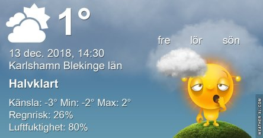

Idag går solen upp 08:25 och ned 15:24 Dagens längd är 6 timmar och 59 minuter. Det är gryning 07:38 och skymning 16:12 Det är dagsljus 8 timmar och 34 minuter. Månen går upp 12:15 och ned 21:32 Månen är belyst 32 %.

 Växlande molnighet - 1 C  Vindby 2,4 m/s NNE  Luftfuktighet 83 %  hPa 1025 Kl.02:25

 Molnigt 0 C  Vindby 1,4 m/s  NW  Luftfuktighet 80 %  hPa 1025 Kl.07:30

Molnigt 2,4 C  Vindby 1,6 m/s N  Luftfuktighet 76 %   hPa 1024 Kl.14:30

 Mest molnigt - 0,2 C  Vindby 1,4 m/s W  Luftfuktighet 82 %  hPa 1024  Regn 0,5 mm Kl.20:00

 Mest grått och kallt men vi fick åtminstone se lite sol idag.

Högst och lägst uppmätta temperatur igår (inofficiellt privat mätare) Max 5,4 C , Min – 3,6 C Högst uppmätta vind 2,4 m/s, Högst uppmätta vindby 4,1 m/s

Högst och lägst uppmätta temperatur igår (officiellt enligt [YR.NO](http://www.vackertvader.se/v%C3%A4derstation/karlshamn?utm_source=email&utm_medium=email&utm_campaign=asarum)) Max ? C, Min ? C Högst uppmätta vind ? m/s. Högst uppmätta vindby ? m/s

\[gallery type="rectangular" link="file" size="medium" ids="25966,25967,25968,25969,25970,25971,25972,25973,25974,25975,25976,25977" orderby="rand"\]

Dagens solnedgång i bilder.
