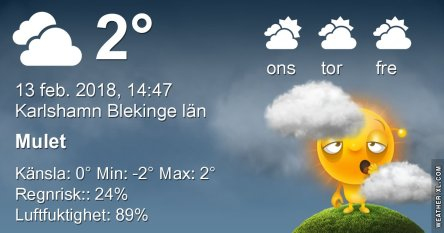
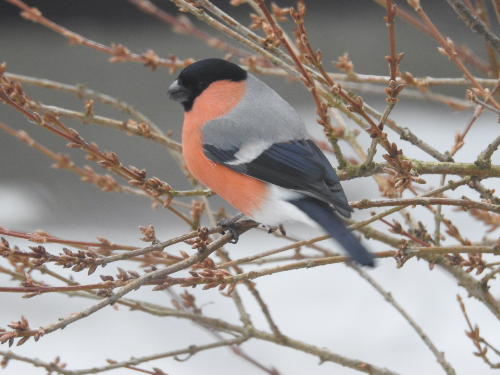
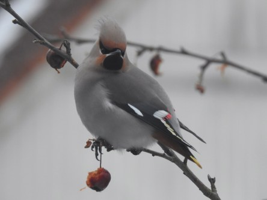

Idag går solen upp 07:32 och ned 16:58. Månen går upp 06:21 och ned 14:26 Månen är belyst 7 %. Dagens längd är 9 timmar och 26 minuter

 Mest klart - 0,6 C  Vindby 2,4 m/s SE  Luftfuktighet 88 %  hPa 1004 Kl.02:30

 Molnigt - 0,2 C  Vindby 0,7 m/s NW  Luftfuktighet 93 %  hPa 1006 Kl.07:35

 Mest molnigt 5,4 C  Vindby 2 m/s SE  Luftfuktighet 85 %  hPa 1008 Kl.13:30

 Molnigt 0,6 C  Vindstilla  Luftfuktighet 94 %  hPa 1011 Kl.20:50

 Grått och tråkigt idag igen. När ska det bli roligare väder?

Högst och lägst uppmätta temperatur igår (inofficiellt privat mätare): Max 5,8 C , Min  0,3 C Högst uppmätta vind 4,4 m/s. Högst uppmätta vindby 7,8 m/s.

Högst och lägst uppmätta temperatur igår (officiellt enligt [YR.NO](http://www.vackertvader.se/v%C3%A4derstation/karlshamn?utm_source=email&utm_medium=email&utm_campaign=asarum)) Max 3,5 C, Min 0,2 C Högst uppmätta vind 3,7 m/s. Högst uppmätta vindby 10 m/s

 Fågelbesök under den senaste tiden. Nu är det slut med mat i trädet så besöken blir mindre och mindre av Sidensvansen.
