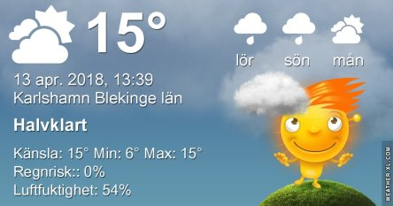
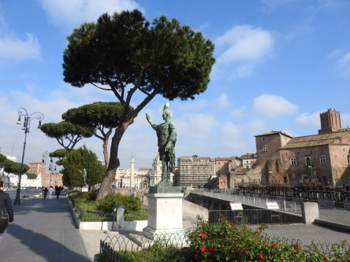

Idag går solen upp 06:00 och ned 20:02. Månen går upp 05:40 och ned 16:38 Månen är belyst 10 %. Dagens längd är 14 timmar och 2 minuter

 Mest klart 5,4 C  Vindby 5 m/s E  Luftfuktighet 68 %  hPa 1012 Kl.02:25

 Ökande molnighet 5,1 C  Vindby 5,4 m/s NNE  Luftfuktighet 73 %  hPa 1011 Kl.06:55

 Mest molnigt och blåsigt 19,4 C  Vindby 12,4 m/s NE  Luftfuktighet 54 %  hPa 1012 Kl.13:05

 Tunna moln 10,6 C  Vindby 4,8 m/s NNE  Luftfuktighet 60 %  hPa 1012 Kl.20:05

 Ännu en blåsig dag, som också är solig och varm.

Högst och lägst uppmätta temperatur igår (inofficiellt privat mätare): Max 17,1 C , Min 0,4 C Högst uppmätta vind ? m/s. Högst uppmätta vindby 11,2 m/s.

Högst och lägst uppmätta temperatur igår (officiellt enligt [YR.NO](http://www.vackertvader.se/v%C3%A4derstation/karlshamn?utm_source=email&utm_medium=email&utm_campaign=asarum)) Max 13,6 C, Min 2,3 C Högst uppmätta vind 5,7 m/s. Högst uppmätta vindby 13,8 m/s

 Idag har jag drömt mig tillbaka ett år och då var vi i Rom och gick och njöt av sol och värme.
