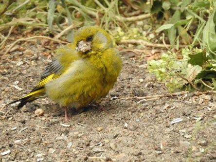
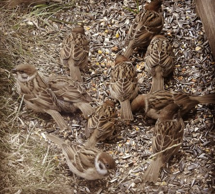

Idag går solen upp 04:12 och ned 21:48. Månen går upp 04:32 och ned 20:54 Det är gryning 03:10 och skymning 22:52 Månen är belyst 1 %. Dagens längd är 17 timmar och 36 minuter. Det är dagsljus 19 timmar och 42 minuter

 Mest molnigt 11,5 C  Vindstilla  Luftfuktighet 95 %  hPa 1004 Kl.02:35

 Lätt regn 14,4 C  Vindstilla  Luftfuktighet 92 %  hPa 1003 Kl.06:25

 Växlande molnighet 26 C  Vindby 2,2 m/s SE  Luftfuktighet 51 %  hPa 1004 Kl.12:35

 Växlande molnighet 19,6 C  Vindby 0,3 m/s N  Luftfuktighet 76 %  hPa 1005 Kl.19:50

 Otroligt! Det har åskat nästan hela dagen men bara 0,7 mm regn.

Högst och lägst uppmätta temperatur igår (inofficiellt privat mätare): Max 26,3 C ( i solen ), Min 12,5 C Högst uppmätta vind 2,7 m/s. Högst uppmätta vindby 4,6 m/s

Högst och lägst uppmätta temperatur igår (officiellt enligt [YR.NO](http://www.vackertvader.se/v%C3%A4derstation/karlshamn?utm_source=email&utm_medium=email&utm_campaign=asarum)) Max 22,4 C, Min 12,3 C Högst uppmätta vind 3,3 m/s. Högst uppmätta vindby 9,1 m/s

 En liten grönfinkunge kom på besök.

 Pappa Hacke har ingen rast eller ro just nu.

 Och pilfinksungar finns det gott om här.
