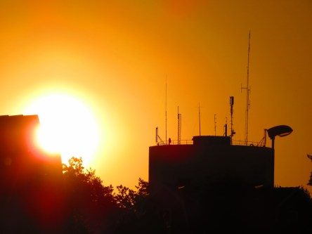

Idag går solen upp 04:49 och ned 21:05. Månen går upp 05:01 och ned 19:29 Månen är belyst 3 %. Dagens längd är 16 timmar och 16 minuter

 Klart 11,1 C  Vindby 2,2 m/s N   Luftfuktighet 68 %  hPa 1015 Kl.01:45

 Mest klart 14,3 C  Vindby 1,4 m/s SW  Luftfuktighet 58 %  hPa 1014 Kl.06:40

 Klart 30,9 C  Vindby 6,6 m/s SSE  Luftfuktighet 35 %  hPa 1015 Kl.14:45

 Halvklart 18,1 C  Vindby 1 m/s W  Luftfuktighet 48 %  hPa 1015 Kl.20:00

 Väldigt varmt och torrt. Nu behövs regn!

Högst och lägst uppmätta temperatur igår (inofficiellt privat mätare): Max 32,5 C ( i solen) , Min 8,9 C Högst uppmätta vind 3,7 m/s. Högst uppmätta vindby 6,5 m/s.

Högst och lägst uppmätta temperatur igår (officiellt enligt [YR.NO](http://www.vackertvader.se/v%C3%A4derstation/karlshamn?utm_source=email&utm_medium=email&utm_campaign=asarum)) Max 23,2 C, Min 9,2 C Högst uppmätta vind 5,1 m/s. Högst uppmätta vindby 9,3 m/s

 Solen går upp till ännu en varm och solig dag.
