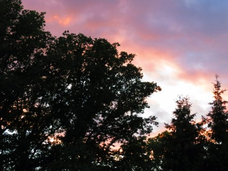
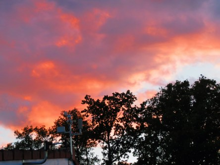

Idag går solen upp 04:12 och ned 21:50. Månen går upp 05:17 och ned 22:06 Det är gryning 03:10 och skymning 22:53 Månen är belyst 0 %. Dagens längd är 17 timmar och 38 minuter. Det är dagsljus 19 timmar och 43 minuter

 Mest klart 9,5 C  Vindby 0,3 m/s W  Luftfuktighet 97 %  hPa 1007 Kl.02:05

 Tunna slöjmoln 17,1 C  Vindby 1,4 m/s SW  Luftfuktighet 62 %  hPa 1009 Kl.07:25

 Växlande molnighet 25,9 C  Vindby 4,8 m/s SW  Luftfuktighet 37 %  hPa 1008 Kl.14:05

 Tunna slöjmoln 17,8 C  Vidby 4,8 m/s S  Luftfuktighet 64 %  hPa 1008 Kl.20:00

 Idag har det varit varmt och blåsigt. Inget regn.

Högst och lägst uppmätta temperatur igår (inofficiellt privat mätare): Max 26 C ( i solen ), Min 12 C Högst uppmätta vind 2,4 m/s. Högst uppmätta vindby 4,1 m/s

Högst och lägst uppmätta temperatur igår (officiellt enligt [YR.NO](http://www.vackertvader.se/v%C3%A4derstation/karlshamn?utm_source=email&utm_medium=email&utm_campaign=asarum)) Max 19,7 C, Min 11,2 C Högst uppmätta vind 3,6 m/s. Högst uppmätta vindby 7,6 m/s

 Pilfinken verkar också vara trött i värmen.

 Gårdagens solnedgång.
