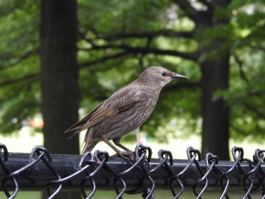

Idag går solen upp 05:28 och ned 20:41. Dagens längd är 15 timmar och 13 minuter. Det är gryning 04:44 och skymning 21:25 Det är dagsljus 16 timmar och 41 minuter. Månen går upp 09:26 och ned 22:06 Månen är belyst 10 %.

 Molnigt 14,5 C  Vindby 1,7 m/s W  Luftfuktighet 99 %  hPa 1004  Regn 0,5 mm KL.02:15

 Mest molnigt 16,5 C  Vindby 2,6 m/s E  Luftfuktighet 97 %  hPa 1002 Kl.06:40

 Växlande molnighet 28,6 C  Vindby 2,4 m/s S  Luftfuktighet 57 %  hPa 1001 Kl.15:15

 Molnigt 17,1 C  Vindby 1 m/s NNE  Luftfuktighet 87 %  hPa 1003 Kl.21:00

 Varmt och kvavt igen. Lite åskmuller långt bort.

Högst och lägst uppmätta temperatur igår (inofficiellt privat mätare): Max 18,2 C, Min 10,7 C Högst uppmätta vind 1,4 m/s. Högst uppmätta vindby 1,7 m/s

Högst och lägst uppmätta temperatur igår (officiellt enligt [YR.NO](http://www.vackertvader.se/v%C3%A4derstation/karlshamn?utm_source=email&utm_medium=email&utm_campaign=asarum)) Max 16,3 C, Min 11,8 C Högst uppmätta vind 2,4 m/s. Högst uppmätta vindby 5 m/s

 Idag fick arkivet rycka in i brist på ork att ta nya bilder. Det här är en ung stare i Central Park.
