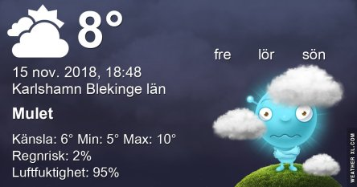

Idag går solen upp 07:38 och ned 15:52 Dagens längd är 8 timmar och 14 minuter. Det är gryning 06:55 och skymning 16:34 Det är dagsljus 9 timmar och 39 minuter. Månen går upp 13:48 och ned 22:40 Månen är belyst 45 %.

 Molnigt 6,7 C  Vindstilla  Luftfuktighet 93 %  hPa 1024 Kl.02:10

 Molnigt 7,4 C  Vindby 0,3 m/s SE  Luftfuktighet 94 %  hPa 1025 Kl.06:25

 Molnigt och disigt 10,2 C  Vindby 1,6 m/s SSE  Luftfuktighet 87 %  hPa 1027 Kl.13:30

 Molnigt och disigt 7,6 C  Vindby 1 m/s W  Luftfuktighet 93 %  hPa 1029 Kl.19:55

 Idag har det varit grått och råkallt med dimma på kvällen.

Högst och lägst uppmätta temperatur igår (inofficiellt privat mätare): Max 13,4 C , Min 3,3 C Högst uppmätta vind 2 m/s, Högst uppmätta vindby 2,4 m/s

Högst och lägst uppmätta temperatur igår (officiellt enligt [YR.NO](http://www.vackertvader.se/v%C3%A4derstation/karlshamn?utm_source=email&utm_medium=email&utm_campaign=asarum)) Max 11,1 C, Min 2,7 C Högst uppmätta vind 2,1 m/s. Högst uppmätta vindby 5,5 m/s

\[gallery type="rectangular" link="file" size="medium" ids="25457,25456,25455,25454,25453,25452"\]

Den här gången är det inte mina egna bilder jag visar utan dessa helt underbart söta djurbilderna som jag hittade på Pinterest. Visst är de helt oemotståndliga.
