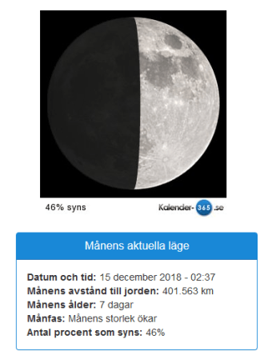
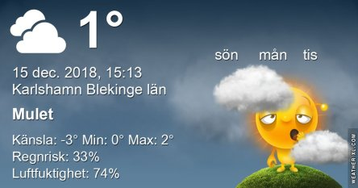

Idag går solen upp 08:27 och ned 15:24 Dagens längd är 6 timmar och 57 minuter. Det är gryning 07:39 och skymning 16:12 Det är dagsljus 8 timmar och 33 minuter. Månen går upp 12:50 och ned 23:51 Månen är belyst 46 %.

 Mest molnigt 0,4 C  Vindby 2,6 m/s NE  Luftfuktighet 80 %  hPa 1028 Kl.02:30

 Molnigt 0 C  Vindby 2,2 m/s N  Luftfuktighet 78 %  hPa 1028 Kl.06:50

 Molnigt 2,2 C  Vindby 2,8 m/s E  Luftfuktighet 75 %  hPa 1027 Kl.13:50

 Molnigt 0,5 C  Vindby 2,8 m/s E  Luftfuktighet 87 %  hPa 1024 Kl.22:20

 Kallt, blött och grått tröttväder igen.

Högst och lägst uppmätta temperatur igår (inofficiellt privat mätare) Max 2,4 C , Min 0 C Högst uppmätta vind 1,7 m/s, Högst uppmätta vindby 2,7 m/s

Högst och lägst uppmätta temperatur igår (officiellt enligt [YR.NO](http://www.vackertvader.se/v%C3%A4derstation/karlshamn?utm_source=email&utm_medium=email&utm_campaign=asarum)) Max 1,6 C, Min 0,7 C Högst uppmätta vind 2 m/s. Högst uppmätta vindby 5,5 m/s

