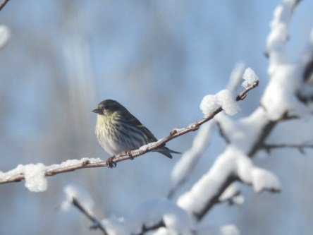

Idag går solen upp 07:27 och ned 17:03. Månen går upp 06:26 och ned 16:36 Månen är belyst 1 %. Dagens längd är 9 timmar och 36 minuter

 Molnigt 0,6 C  Vindby 2,2 m/s ESE  Luftfuktighet 68 %  hPa 1019 Kl.02:30

 Växlande molnighet - 0,2 C  Vindby 2,2 m/s NNE  Luftfuktighet 83 %  hPa 1018 Kl.07:10

 En del solglimtar 3,3 C  Vindby 4,8 m/s NW  Luftfuktighet 62 %  hPa 1016 Kl.13:25

 Växlande molnighet 0,5 C  Vindby 4,4 m/s NW  Luftfuktighet 72 %  hPa 1013 Kl.19:50

 Det har varit blåsigt och en del sol mellan molnen idag.

Högst och lägst uppmätta temperatur igår (inofficiellt privat mätare): Max 5,8 C , Min – 0,8 C Högst uppmätta vind 1,4 m/s. Högst uppmätta vindby 3,1 m/s.

Högst och lägst uppmätta temperatur igår (officiellt enligt [YR.NO](http://www.vackertvader.se/v%C3%A4derstation/karlshamn?utm_source=email&utm_medium=email&utm_campaign=asarum)) Max 2 C, Min – 1 C Högst uppmätta vind 2,2 m/s. Högst uppmätta vindby 6,3 m/s

 Koltrast från Februari 2017.

 Grönsiska från Februari 2017

 Och sist men inte minst, en riktig balanskonstnär. Blåmes från Februari 2017. Som synes var det en hel del snö för ett år sedan. Betydligt mer än i år.
