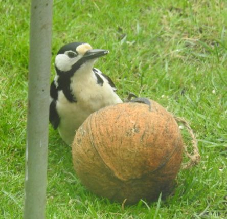
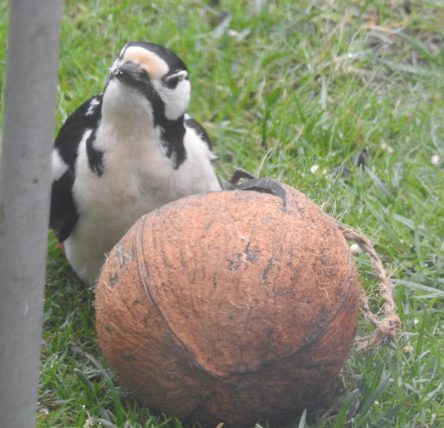
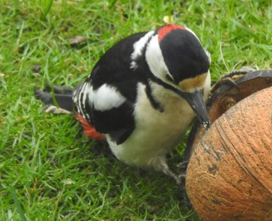
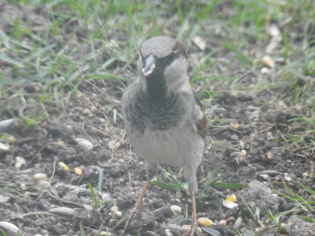
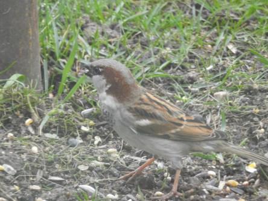

Idag går solen upp 05:55 och ned 20:07. Månen går upp 06:18 och ned 19:12 Månen är belyst 1 %. Dagens längd är 14 timmar och 12 minuter

 Dimma 4,3 C  Vindby 1,8 m/s SE  Luftfuktighet 99 %  hPa 1013 Kl.01:25

 Dimma 5,5 C  Vindby 0,3 m/s SW   Luftfuktighet 99 %  hPa 1011 Kl.07:55

 Molnigt 0ch dimma 11,6 C  Vindby 0,7 m/s WSW  Luftfuktighet 99 %  hPa 1011 Kl.13:20

 Molnigt 6,3 C  Vindby 2,4 m/s N  Luftfuktighet 95 %  hPa 1010 Kl.19:45

 Grått och småregn efter en dimmig natt och morgon.

Högst och lägst uppmätta temperatur igår (inofficiellt privat mätare): Max 21,5 C , Min 4 C Högst uppmätta vind 3,1 m/s. Högst uppmätta vindby 5,1 m/s.

Högst och lägst uppmätta temperatur igår (officiellt enligt [YR.NO](http://www.vackertvader.se/v%C3%A4derstation/karlshamn?utm_source=email&utm_medium=email&utm_campaign=asarum)) Max 16,8 C, Min 4,3 C Högst uppmätta vind 5 m/s. Högst uppmätta vindby 8,7 m/s

 Idag kom pappa Hacke på besök och för första gången i år så var även gråsparvarna här. Inte världens bästa bilder eftersom de är tagna genom fönstret och det var väldigt grått ute dessutom
