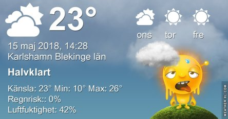

Idag går solen upp 04:47 och ned 21:07. Månen går upp 05:24 och ned 20:53 Månen är belyst 0 %. Dagens längd är 16 timmar och 20 minuter

 Tunna moln 6,7 C  Vindstilla  Luftfuktighet 99 %   hPa 1015 Kl.02:15

 Mest molnigt 9,9 C  Vindstilla  Luftfuktighet 97 %  hPa 1014 Kl.06:55

 Tunna slöjmoln 28,2 C  Vindby 2,6 m/s SSE  Luftfuktighet 38 %  hPa 1013 Kl.14:25

 Tunna slöjmoln 19,8 C  Vindby 0,8 m/s SW  Luftfuktighet 43 %  hPa 1012 Kl.19:50

 Man skäms lite när man klagar på värmen efter den sega vintern, men nu ÄR det verkligen för varmt och torrt. Regn är vad som behövs nu.

Högst och lägst uppmätta temperatur igår (inofficiellt privat mätare): Max 31,1 C ( i solen) , Min 9,8 C Högst uppmätta vind 2,7 m/s. Högst uppmätta vindby 4,8 m/s.

Högst och lägst uppmätta temperatur igår (officiellt enligt [YR.NO](http://www.vackertvader.se/v%C3%A4derstation/karlshamn?utm_source=email&utm_medium=email&utm_campaign=asarum)) Max 26,6 C, Min 7,4 C Högst uppmätta vind 4,9 m/s. Högst uppmätta vindby 9,9 m/s

 Dagen började bra med en hel del moln, så man fick nästan lite hopp om regn. Men det visade sig vara fake news,hahaha.
