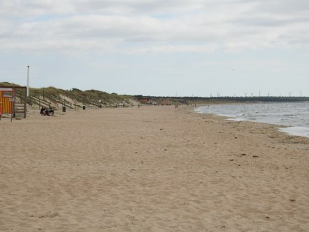
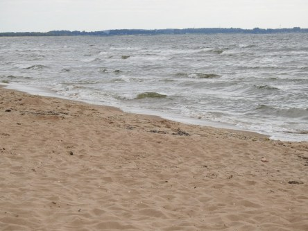
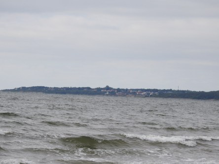
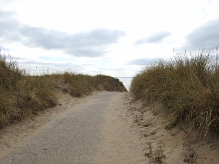
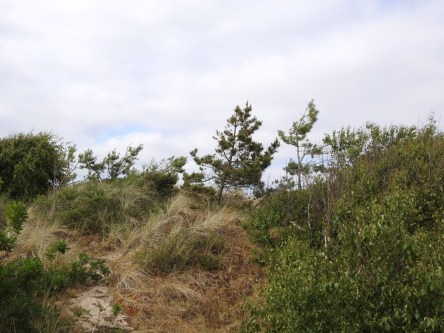

Idag går solen upp 04:34 och ned 21:38. Dagens längd är 17 timmar och 04 minuter. Det är gryning 03:37 och skymning 22:35 Det är dagsljus 18 timmar och 58 minuter. Månen går upp 07:40 och ned 22:57 Månen är belyst 6 %.

 Klart 13,6 C  Vindby 0,8 m/s N  Luftfuktighet 78 %  hPa 1011 Kl.01:35

 Mest klart 19,8 C  Vindby 2 m/s SE  Luftfuktighet 67 %  hPa 1012 Kl.07:15

 Klart 33,9 C  Vindby 2,8 m/s W  Luftfuktighet 85 %  hPa 1011 Kl.13:35

 Växlande molnighet 27,3 C  Vindby 3,4 m/s SW  Luftfuktighet 33 %  hPa 1010 Kl.19:50

 Usch vad trött man är på denna eviga hetta!

Högst och lägst uppmätta temperatur igår (inofficiellt privat mätare): Max 32 C  ( i solen ), Min 13,9 C Högst uppmätta vind 3,4  m/s. Högst uppmätta vindby 5,4  m/s

Högst och lägst uppmätta temperatur igår (officiellt enligt [YR.NO](http://www.vackertvader.se/v%C3%A4derstation/karlshamn?utm_source=email&utm_medium=email&utm_campaign=asarum)) Max 28,5 C, Min 12,7 C Högst uppmätta vind 3,4 m/s. Högst uppmätta vindby 8,6 m/s

 En liten promenad vid havet i Ängelholm.
