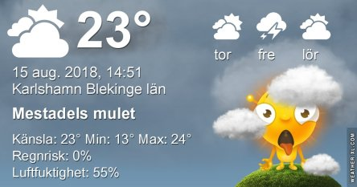
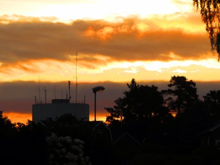

Idag går solen upp 05:30 och ned 20:38. Dagens längd är 15 timmar och 08 minuter. Det är gryning 04:47 och skymning 21:22 Det är dagsljus 16 timmar och 35 minuter. Månen går upp 10:47 och ned 22:24 Månen är belyst 18 %.

 Molnigt 15,7 C  Vindby 1 m/s NW  Luftfuktighet 93 %  hPa 1004 Kl.02:05

 Mest molnigt 15,6 C  Vindby 2 m/s WSW  Luftfuktighet 92 %  hPa 1006 Kl.06:35

 Växlande molnighet 29,6 C  Vindby 4,2 m/s S  Luftfuktighet 39 %  hPa 1010 Kl.14:05

 Halvklart 19,5 C  Vindby 0,7 m/s SW  Luftfuktighet 63 %  hPa 1012 Kl.20:05

 Idag var värmen tillbaks igen! Suck.

Högst och lägst uppmätta temperatur igår (inofficiellt privat mätare): Max 31,2 ( i solen ) C, Min 13,8 C Högst uppmätta vind 2,4 m/s. Högst uppmätta vindby 6,2 m/s

Högst och lägst uppmätta temperatur igår (officiellt enligt [YR.NO](http://www.vackertvader.se/v%C3%A4derstation/karlshamn?utm_source=email&utm_medium=email&utm_campaign=asarum)) Max 16,3 C, Min 11,8 C Högst uppmätta vind 2,4 m/s. Högst uppmätta vindby 5 m/s

 Mörka moln tornade upp sig på morgonen men tyvärr tog solen överhanden idag.
