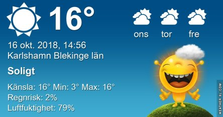
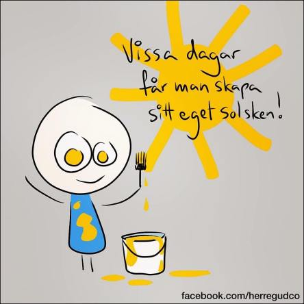
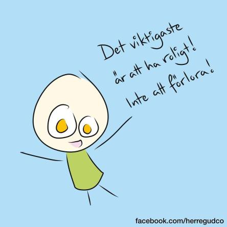

Idag går solen upp 07:34 och ned 17:57. Dagens längd är 10 timmar och 23 minuter. Det är gryning 06:56 och skymning 18:35 Det är dagsljus 11 timmar och 39 minuter. Månen går upp 15:12 och ned 22:43 Månen är belyst 44 %.

 Klart 3,3 C  Vindstilla  Luftfuktighet 94 %  hPa 1012 Kl.02:20

 Klart 2,7 C   Vindby 0,3 m/s N  Luftfuktighet 95 %  hPa 1013 Kl.07:00

 Halvklart 25 C  Vindby 1,4 m/s E  Luftfuktighet 43 %  hPa 1014 Kl.14:15

 Klart 6,6 C  Vindstilla  Luftfuktighet 95 %  hPa 1015 Kl.21:05

 Fortfarande sommarvärme och väldigt torrt här. När ska det komma ordentligt med regn?

Högst och lägst uppmätta temperatur igår (inofficiellt privat mätare): Max 20,7 C , Min 3,2 C Högst uppmätta vind 1,7 m/s, Högst uppmätta vindby 3,4 m/s

Högst och lägst uppmätta temperatur igår (officiellt enligt [YR.NO](http://www.vackertvader.se/v%C3%A4derstation/karlshamn?utm_source=email&utm_medium=email&utm_campaign=asarum)) Max 16,2 C, Min  1,6 C Högst uppmätta vind 3 m/s. Högst uppmätta vindby 5,8 m/s

 Idag får det bli fler kloka ord igen!
