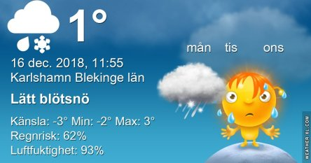

Idag går solen upp 08:28 och ned 15:24 Dagens längd är 6 timmar och 56 minuter. Det är gryning 07:40 och skymning 16:12 Det är dagsljus 8 timmar och 32 minuter. Månen går upp 12:47 och ned 23:59 Månen är belyst 55 %.

 Molnigt - 0,2 C  Vindby 0,3 m/s W  Luftfuktighet 89 %  hPa 1022 Kl.01:35

 Molnigt  0,2 C  Vindby 1,8 m/s ENE  Luftfuktighet 88 %  hPa 1017 Kl.08:30

 Snö 2,2 C  Vindby 0,7 m/s NW  Luftfuktighet 88 %  hPa 1015  Regn/snö 1,8 mm Kl.12:00

 Molnigt - 0,5 C  Vindstilla  Luftfuktighet 89 %  hPa 1012 Kl.20:50

 Idag vaknade vi upp till ett helt vitt landskap!

Högst och lägst uppmätta temperatur igår (inofficiellt privat mätare) Max 2,2 C , Min 0 C Högst uppmätta vind 2 m/s, Högst uppmätta vindby 3,8 m/s

Högst och lägst uppmätta temperatur igår (officiellt enligt [YR.NO](http://www.vackertvader.se/v%C3%A4derstation/karlshamn?utm_source=email&utm_medium=email&utm_campaign=asarum)) Max 1,6 C, Min 0,7 C Högst uppmätta vind 2 m/s. Högst uppmätta vindby 5,5 m/s

\[gallery type="rectangular" link="file" size="medium" ids="26041,26042,26043,26044"\]

Jag tror fåglarna blev lika snopna som vi när allt plötsligt blev vitt ute!

