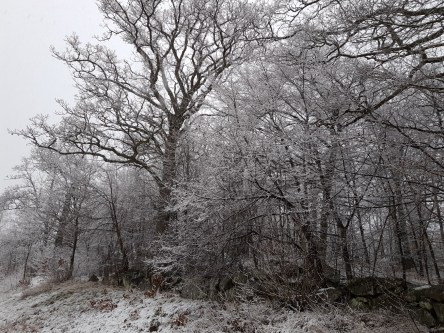

Idag går solen upp 07:25 och ned 17:05. Månen går upp 07:50 och ned 17:46 Månen är belyst 0 %. Dagens längd är 9 timmar och 40 minuter

 Molnigt 0,1 C  Vindby 4,4 m/s W  Luftfuktighet 81 %  hPa 1009 Kl.02:05

 Molnigt 0,2 C  Vindstilla  Luftfuktighet 95 %  hPa 1008  Snö ca. 1 cm Kl.07:10

 Molnigt 5,5 C  Vindby 2,2 m/s ESE  Luftfuktighet 90 %  hPa 1010 Kl.13:10

 Molnigt 0,1 C  Vindstilla  Luftfuktighet 95 %  hPa 1012  Regn/snö 3,7 mm Kl.19:45

 Först snö, sen regn, sen lite sol, sen regn och sen snö igen. Suck.

Högst och lägst uppmätta temperatur igår (inofficiellt privat mätare): Max 4,9 C , Min – 0,9 C Högst uppmätta vind 3,1 m/s. Högst uppmätta vindby 5,8 m/s.

Högst och lägst uppmätta temperatur igår (officiellt enligt [YR.NO](http://www.vackertvader.se/v%C3%A4derstation/karlshamn?utm_source=email&utm_medium=email&utm_campaign=asarum)) Max 1,7 C, Min 0,4 C Högst uppmätta vind 4,4 m/s. Högst uppmätta vindby 10,3 m/s

 Allt är vitt igen.
