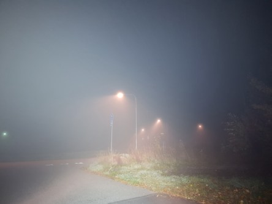
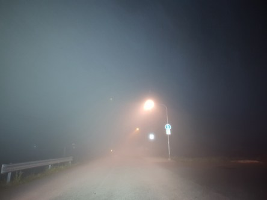
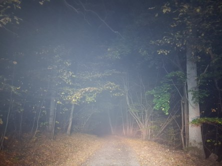
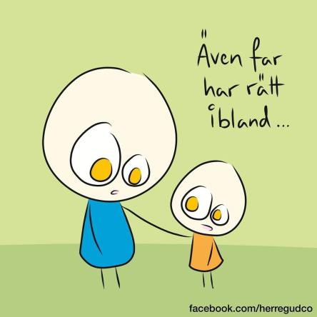

Idag går solen upp 07:36 och ned 17:55. Dagens längd är 10 timmar och 19 minuter. Det är gryning 06:58 och skymning 18:33 Det är dagsljus 11 timmar och 35 minuter. Månen går upp 15:49 och ned 23:44 Månen är belyst 53 %.

 Dimma 5 C  Vindstilla  Luftfuktighet 97 %  hPa 1015 Kl.02:15

 Dimma 3,6 C  Vindstilla  Luftfuktighet 98 %  hPa 1015 Kl.07:30

 Tunna slöjmoln 23,9 C  Vindby 1 m/s N  Luftfuktighet 58 %  hPa 1016 Kl.13:35

 Lite disigt 7,7 C  Vindstilla  Luftfuktighet 93 %  hPa 1015 Kl.19:55

 Härlig lagom värme men inget regn ännu och inget i sikte!

Högst och lägst uppmätta temperatur igår (inofficiellt privat mätare): Max 25 C , Min 2,7 C Högst uppmätta vind 1,4 m/s, Högst uppmätta vindby 2 m/s

Högst och lägst uppmätta temperatur igår (officiellt enligt [YR.NO](http://www.vackertvader.se/v%C3%A4derstation/karlshamn?utm_source=email&utm_medium=email&utm_campaign=asarum)) Max 19,6 C, Min  1,8 C Högst uppmätta vind 1,8 m/s. Högst uppmätta vindby 3,4 m/s

 Dimman var väldigt tät bitvis inatt.

 Också några fler kloka ord så klart.
