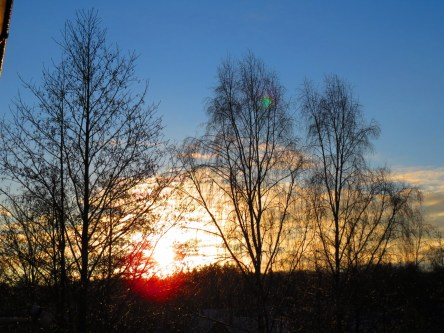

Idag går solen upp 07:22 och ned 17:07. Månen går upp 08:11 och ned 18:58 Månen är belyst 1 %. Dagens längd är 9 timmar och 45 minuter

 Molnigt 0,1 C  Vindby 1,2 m/s SSE  Luftfuktighet 96 %  hPa 1015 Kl.02:20

 Växlande molnighet - 0,8 C  Vindstilla  Luftfuktighet 95 %  hPa 1017 Kl.06:55

 Växlande molnighet 6,2 C  Vindby 1 m/s N  Luftfuktighet 71 %  hPa 1018 Kl.14:05

Växlande molnighet - 1,9 C  Vindstilla   Luftfuktighet 90 %  hPa 1020 Kl.20:25

 Ovanligt vackert väder idag med sol och lite värme.

Högst och lägst uppmätta temperatur igår (inofficiellt privat mätare): Max 5,7 C , Min – 0,2 C Högst uppmätta vind 3,1 m/s. Högst uppmätta vindby 5,4 m/s.

Högst och lägst uppmätta temperatur igår (officiellt enligt [YR.NO](http://www.vackertvader.se/v%C3%A4derstation/karlshamn?utm_source=email&utm_medium=email&utm_campaign=asarum)) Max 2,8 C, Min - 0,2 C Högst uppmätta vind 2,5 m/s. Högst uppmätta vindby 7,3 m/s

 Idag fick vi se både en soluppgång...

 och en solnedgång.
