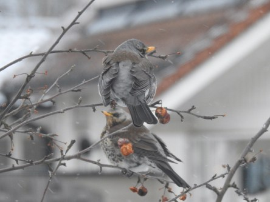
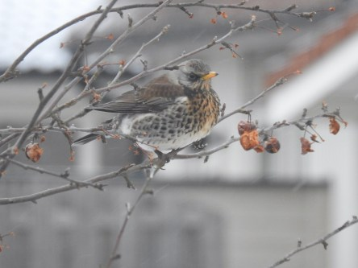
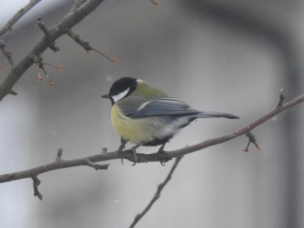
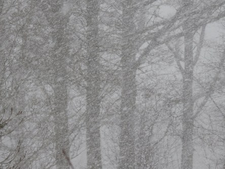

Idag går solen upp 06:12 och ned 18:07. Månen går upp 06:36 och ned 17:58 Månen är belyst 0 %. Dagens längd är 11 timmar och 55 minuter

 Klart - 8,4 C  Vindby 4,2 m/s ENE  Luftfuktighet 73 %  hPa 1020 Kl.02:15

 Snö - 7,2 C  Vindby 1,8 m/s N  Luftfuktighet 72 %  hPa 1021 Kl.06:40

 Växlande molnighet 0,7 C  Vindby 2,7 m/s S  Luftfuktighet 56 %  hPa 1022  Snödjup 3 cm Kl.14:00

 Klart - 7,3 C  Vindby 1,6 m/s E  Luftfuktighet 70 %  hPa 1023 Kl.19:50

 Ny snöstorm och iskyla idag igen. Nu får det väl ändå räcka?

Högst och lägst uppmätta temperatur igår (inofficiellt privat mätare): Max 1,5 C , Min – 8,3 C Högst uppmätta vind 4,8 m/s. Högst uppmätta vindby 10,2 m/s.

Högst och lägst uppmätta temperatur igår (officiellt enligt [YR.NO](http://www.vackertvader.se/v%C3%A4derstation/karlshamn?utm_source=email&utm_medium=email&utm_campaign=asarum)) Max – 0,8 C, Min – 6,8 C Högst uppmätta vind 5,4 m/s. Högst uppmätta vindby 14 m/s

 Det kom många hungriga matgäster här idag i snöovädret.

 Det var knappt att man såg handen framför sig bitvis.
