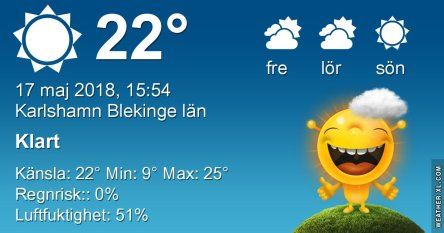
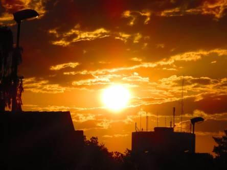

Idag går solen upp 04:43 och ned 21:11. Månen går upp 06:32 och ned 23:30 Månen är belyst 4 %. Dagens längd är 16 timmar och 28 minuter

 Växlande molnighet 9,2 C  Vindstilla  Luftfuktighet 96 %  hPa 1007 Kl.01:50

 Tunna slöjmoln 9,7 C  Vindstilla  Luftfuktighet 98 %  hPa 1007 Kl.06:55

 Mest klart 28,1 C  Vindby 3 m/s WSW  Luftfuktighet 52 %  hPa 1008 Kl.15:05

 Växlande molnighet 16,2 C  Vindstilla  Luftfuktighet 73 %  hPa 1009 Kl.19:55

 Äntligen lite svalare idag. Känns mer som normal sommar.

Högst och lägst uppmätta temperatur igår (inofficiellt privat mätare): Max 34,5 C ( i solen) , Min 7,9 C Högst uppmätta vind ? m/s. Högst uppmätta vindby 3,4 m/s.

Högst och lägst uppmätta temperatur igår (officiellt enligt [YR.NO](http://www.vackertvader.se/v%C3%A4derstation/karlshamn?utm_source=email&utm_medium=email&utm_campaign=asarum)) Max 25,3 C, Min 8,2 C Högst uppmätta vind 3,3 m/s. Högst uppmätta vindby 7,1 m/s

 Idag roade jag mig med att göra lite alternativa soluppgångar. Det här är originalet.

 Vi ska nog vara tacksamma för att vi inte har två solar nu när det är så varmt.

 Eller ännu värre, fyra!

 Det räcker gott med den vi har.

 Men det kan alltid bli värre. Sex stycken till exempel.

 Eller varför inte en knall lila soluppgång.

 Det går att variera soluppgången hur mycket som helst och den är ändå lika vacker.
