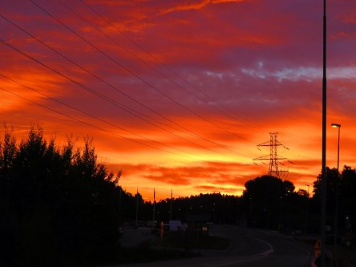
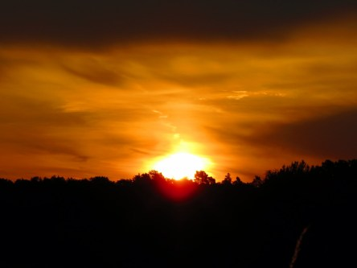
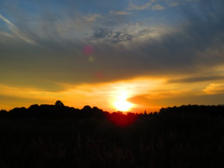

Idag går solen upp 04:37 och ned 21:36. Dagens längd är 16 timmar och 59 minuter. Det är gryning 03:41 och skymning 22:31 Det är dagsljus 18 timmar och 50 minuter. Månen går upp 10:28 och ned 23:42 Månen är belyst 29 %.

 Mest molnigt 15,5 C  Vindstilla  Luftfuktighet 70 %  hPa 1009 Kl.02:30

 Molnigt 19.7 C  Vindby 2,4 m/s NNE  Luftfuktighet 60 %  hPa 1009 Kl.06:35

 Åska och regn 23 C  Vindby 7,8  m/s NW  Luftfuktighet 53 %  hPa 1008  Regn 6,5 mm Kl.13:45

 Molnigt 24 C  Vindby 1,6 m/s NNE  Luftfuktighet 70 %  hPa 1007 Kl.20:00

 Idag kom det äntligen lite välbehövligt regn även om det var alldeles för lite. Det skulle behövas mångdubbelt mer. Men det var härligt så länge det varade ändå.

Högst och lägst uppmätta temperatur igår (inofficiellt privat mätare): Max 36,5 C  ( i solen ), Min 13 C Högst uppmätta vind 3,1  m/s. Högst uppmätta vindby 6,4  m/s

Högst och lägst uppmätta temperatur igår (officiellt enligt [YR.NO](http://www.vackertvader.se/v%C3%A4derstation/karlshamn?utm_source=email&utm_medium=email&utm_campaign=asarum)) Max 28,1 C, Min 12,6 C Högst uppmätta vind 3,3 m/s. Högst uppmätta vindby 6,9 m/s

 

 Dagens soluppgång. Hur less jag än är på solen just nu så går det inte att förneka att det är vackert när den går upp på morgonen. Speciellt när det är så mycket moln som det var idag. Det blir en väldigt speciell effekt med moln när solen går upp.
