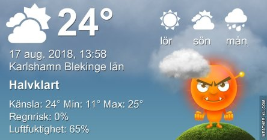

Idag går solen upp 05:34 och ned 20:34. Dagens längd är 15 timmar och 00 minuter. Det är gryning 04:51 och skymning 21:17 Det är dagsljus 16 timmar och 26 minuter. Månen går upp 13:22 och ned 23:04 Månen är belyst 37 %.

 Tunna moln 16,8 C  Vindby 1,2 m/s E  Luftfuktighet 95 %  hPa 1011 Kl.02:25

 Mest molnigt 16,6 C  Vindstilla  Luftfuktighet 97 %  hPa 1011 Kl.07:05

 Mest molnigt 32,4 V  Vindby 1,6 m/s WSW  Luftfuktighet 52 %  hPa 1010 Kl.13:30

 Molnigt 17,6 C  Vindby 2 m/s S  Luftfuktighet 80 %  hPa 1012 Kl.19:50

 Jag står inte ut snart! Trots alla moln så är det 30 grader här!

Högst och lägst uppmätta temperatur igår (inofficiellt privat mätare): Max 29,7 ( i solen ) C, Min 10,1 C Högst uppmätta vind 5,8 m/s. Högst uppmätta vindby 7,8 m/s

Högst och lägst uppmätta temperatur igår (officiellt enligt [YR.NO](http://www.vackertvader.se/v%C3%A4derstation/karlshamn?utm_source=email&utm_medium=email&utm_campaign=asarum)) Max 23,1 C, Min 9,8 C Högst uppmätta vind 4,1 m/s. Högst uppmätta vindby 8,6 m/s

 En varm natt blev ännu en outhärdligt varm dag. När ska eländet ta slut på riktigt?
