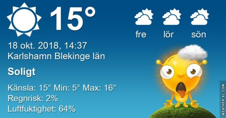
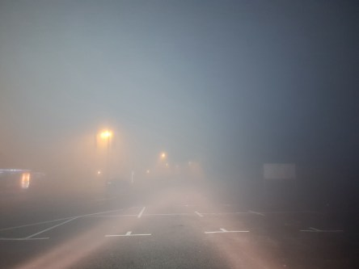
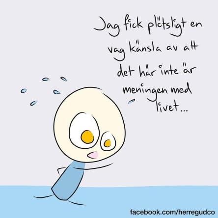
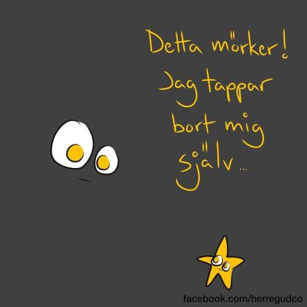
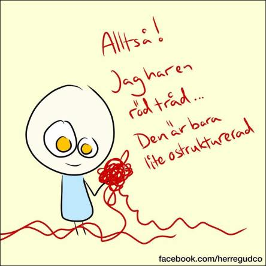
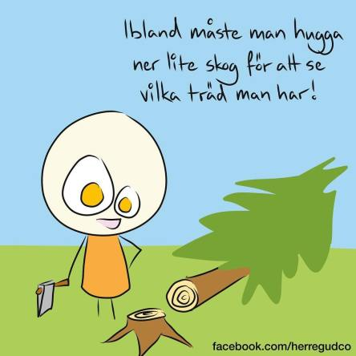

Idag går solen upp 07:38 och ned 17:52. Dagens längd är 10 timmar och 14 minuter. Det är gryning 07:00 och skymning 18:30 Det är dagsljus 11 timmar och 30 minuter. Månen går upp 16:16 och ned 00:55 Månen är belyst 62 %.

 Dimma 7 C  Vindstilla  Luftfuktighet 98 %  hPa 1015 Kl.01:50

 Lätt dimma 6,3 C  Vindstilla  Luftfuktighet 97 %  hPa 1014 Kl.06:50

 Växlande molnighet 20,7 C  Vindby 2,8 m/s NNW  Luftfuktighet 51 %  hPa 1015 Kl.14:00

 Klart 4,3 C  Vindstilla  Luftfuktighet 84 %  hPa 1018 Kl.19:45

 Fortfarande inget regn!

Högst och lägst uppmätta temperatur igår (inofficiellt privat mätare): Max 24 C , Min 3,5 C Högst uppmätta vind 1 m/s, Högst uppmätta vindby 2 m/s

Högst och lägst uppmätta temperatur igår (officiellt enligt [YR.NO](http://www.vackertvader.se/v%C3%A4derstation/karlshamn?utm_source=email&utm_medium=email&utm_campaign=asarum)) Max 19 C, Min 3,6 C Högst uppmätta vind 2,5 m/s. Högst uppmätta vindby 4,1 m/s

 Det var extremt dimmigt inatt. Vägen var så blöt att det såg ut som om det hade regnat. Tyvärr hade det inte det.

 Ännu mer kloka ord. Det går inte att få nog av dem.

 Så därför köpte jag en evighetsalmanacka med ett citat för varje dag på året. Och den går att använda om och om igen. Tills man tröttnar på den. Om nu det är möjligt hahaha.
