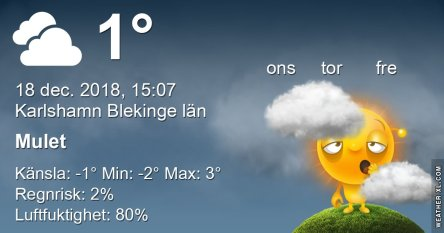

Idag går solen upp 08:30 och ned 15:25 Dagens längd är 6 timmar och 55 minuter. Det är gryning 07:42 och skymning 16:12 Det är dagsljus 8 timmar och 30 minuter. Månen går upp 13:38 och ned 02:18 Månen är belyst 75 %.

 

 Molnigt - 1,3 C  Vindstilla  Luftfuktighet 89 %  hPa 1021 Kl.02:25

 Molnigt - 0,9 C  Vindstilla  Luftfuktighet 90 %  hPa 1022 Kl.07:35

 Molnigt 1,4 C  Vindby 0,3 m/s W  Luftfuktighet 82 %  hPa 1022 Kl.13:10

 Regn 1,3 C  Vindby 1,6 m/s ENE  Luftfuktighet 82 %  hPa 1021  Regn 0,5 mm Kl.20:55

 Grått och trist igen och nu har det töat hela dagen så det fina vita är det inte så mycket kvar av snart

Högst och lägst uppmätta temperatur igår (inofficiellt privat mätare) Max 1,1 C , Min – 2,8 C Högst uppmätta vind 0 m/s, Högst uppmätta vindby 0,7 m/s

Högst och lägst uppmätta temperatur igår (officiellt enligt [YR.NO](http://www.vackertvader.se/v%C3%A4derstation/karlshamn?utm_source=email&utm_medium=email&utm_campaign=asarum)) Max - 0,5 C, Min – 1,6 C Högst uppmätta vind 1,4 m/s. Högst uppmätta vindby 2,8 m/s

 Så här såg det ut igår på baksidan av huset.

 Idag började det töa igen.

 Varför pekar du dit? Vad har du gömt där måntro?
