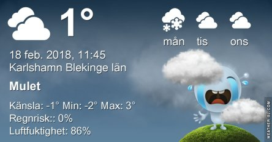
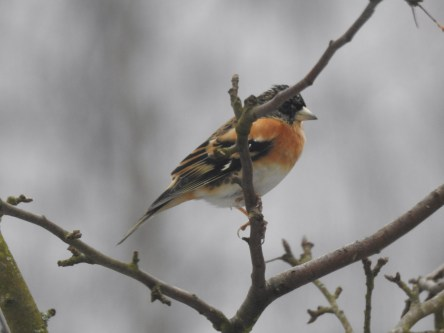
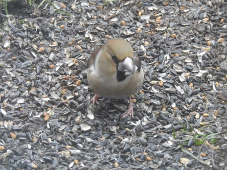
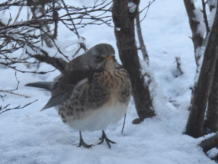

Idag går solen upp 07:20 och ned 17:09. Månen går upp 08:30 och ned 20:12 Månen är belyst 5 %. Dagens längd är 9 timmar och 49 minuter

 Växlande molnighet - 3,9 C  Vindstilla  Luftfuktighet 90 %   hPa 1022 Kl.01:50

 Molnigt - 1,7 C  Vindstilla  Luftfuktighet 96 %  hPa 1022 Kl.07:00

 Molnigt 3,2 C  Vindby 0,3 m/s NW  Luftfuktighet 82 %  hPa 1023 Kl.13:15

 Molnigt 0,3 C  Vindby 0,4 m/s SE  Luftfuktighet 76 %  hPa 1021 Kl.19:55

 Usch, grått och trist och nu ska det bli kallare igen.

Högst och lägst uppmätta temperatur igår (inofficiellt privat mätare): Max 7,7 C ( i solen ), Min – 4,2 C Högst uppmätta vind 1,4 m/s. Högst uppmätta vindby 3,2 m/s.

Högst och lägst uppmätta temperatur igår (officiellt enligt [YR.NO](http://www.vackertvader.se/v%C3%A4derstation/karlshamn?utm_source=email&utm_medium=email&utm_campaign=asarum)) Max 3,8 C, Min – 2,8 C Högst uppmätta vind 2,5 m/s. Högst uppmätta vindby 5,3 m/s

 En liten färgklick bland allt det gråa idag.

 Bilder från veckan som gått på Stenknäck överst, Grönsiska i mitten och nederst Björktrast.
