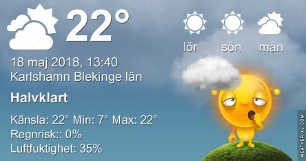

Idag går solen upp 04:41 och ned 21:13. Månen går upp 07:22 och ned 00:34 Månen är belyst 9 %. Dagens längd är 16 timmar och 32 minuter

 Mest klart 6,9 C  Vindstilla  Luftfuktighet 99 %  hPa 1010 Kl.01:55

 Växlande molnighet 10,5 C  Vindby 0,7 m/s N  Luftfuktighet 83 %  hPa 1011 Kl.07:25

 Växlande molnighet 29 C  Vindby 3 m/s E  Luftfuktighet 34 %  hPa 1012 Kl.13:20

 Mest molnigt 14,1 C  Vindby 2,4 m/s NE  Luftfuktighet 66 %  hPa 1015 Kl.19:50

 Idag har det varit lite mindre varmt, men fortfarande varmt.

Högst och lägst uppmätta temperatur igår (inofficiellt privat mätare): Max 29,7 C ( i solen) , Min 6,8 C Högst uppmätta vind 2,7 m/s. Högst uppmätta vindby 4,8 m/s.

Högst och lägst uppmätta temperatur igår (officiellt enligt [YR.NO](http://www.vackertvader.se/v%C3%A4derstation/karlshamn?utm_source=email&utm_medium=email&utm_campaign=asarum)) Max 25,4 C, Min 6,3 C Högst uppmätta vind 3,6 m/s. Högst uppmätta vindby 7,1 m/s

 Minnen från Paris.

 Och från slottet i Versaille.
