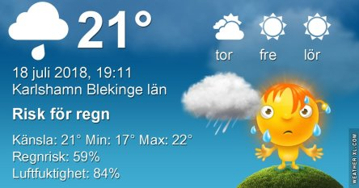
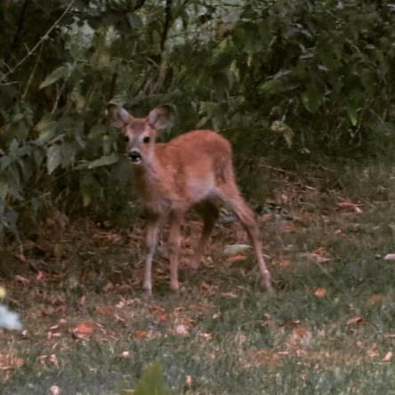

Idag går solen upp 04:39 och ned 21:34. Dagens längd är 16 timmar och 55 minuter. Det är gryning 03:43 och skymning 22:29 Det är dagsljus 18 timmar och 48 minuter. Månen går upp 11:49 och ned 00:08 Månen är belyst 32 %.

 Molnigt 19,3 C  Vindby 0,8 m/s NE  Luftfuktighet 81 %  hPa 1007 Kl.02:25

 Regn 17,5 C  Vindby 0,8 m/s ESE  Luftfuktighet 97 %  hPa 1008  Regn 2,2 mm Kl.06:40

 Molnigt 23,1 C  Vindby 1,2 m/s N  Luftfuktighet 91 %  hPa 1008  Regn 7,2 mm Kl.13:15

 Molnigt 20,5 C  Vindby 1,6 m/s E  Luftfuktighet 79 %  hPa 1008 Kl.19:50

 Äntligen har det regnat lite. Mycket mer behövs dock. Men känslan av regn var härlig så länge det varade.

Högst och lägst uppmätta temperatur igår (inofficiellt privat mätare): Max 38,2 C  ( i solen ), Min 16,1 C Högst uppmätta vind 5,1  m/s. Högst uppmätta vindby 7,8  m/s

Högst och lägst uppmätta temperatur igår (officiellt enligt [YR.NO](http://www.vackertvader.se/v%C3%A4derstation/karlshamn?utm_source=email&utm_medium=email&utm_campaign=asarum)) Max 30,5 C, Min 14,7 C Högst uppmätta vind 3,3 m/s. Högst uppmätta vindby 7,3 m/s

 Idag såg jag det lilla kidet som jag fick en bild på i det höga gräset i våras. Den har vuxit en hel del under sommaren och var riktigt sprallig. Det var inte lätt att få den på bild eftersom den var ganska lågt bort och inte ville vara stilla. Dessutom var det mulet och dåligt ljus och den valde naturligtvis att ställa sig under en buske den korta tid den stod stilla. Men en oskarp mörk bild är bättre än ingen alls.
