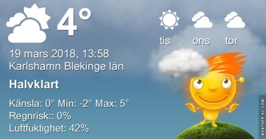

Idag går solen upp 06:06 och ned 18:11. Månen går upp 07:13 och ned 20:32 Månen är belyst 2 %. Dagens längd är 12 timmar och 5 minuter

 Klart - 11 C  Vindstilla  Luftfuktighet 77 %  hPa 1017 Kl.01:55

 Tunna slöjmoln - 11,6 C  Vindstilla  Luftfuktighet 83 %  hPa 1014 Kl.06:50

 Tunna slöjmoln 8.8 C ( i solen )  Vindby 7,2 m/s SSW  Luftfuktighet 44 %  hPa 1009 Kl.13:30

 Växlande molnighet - 2,8 C  Vindstilla  Luftfuktighet 64 %  hPa 1005 Kl.19:55

 En hel del sol och slöjmoln och ganska blåsigt idag.

Högst och lägst uppmätta temperatur igår (inofficiellt privat mätare): Max 10,2 C ( i solen ) , Min – 10 C Högst uppmätta vind 2 m/s. Högst uppmätta vindby 5 m/s.

Högst och lägst uppmätta temperatur igår (officiellt enligt [YR.NO](http://www.vackertvader.se/v%C3%A4derstation/karlshamn?utm_source=email&utm_medium=email&utm_campaign=asarum)) Max 2,5 C, Min – 9 C Högst uppmätta vind 2,8 m/s. Högst uppmätta vindby 5,9 m/s

 Första soluppgången i år.

 Och solnedgången idag. Jag roade mig med att redigera bilderna med HDR Max.
