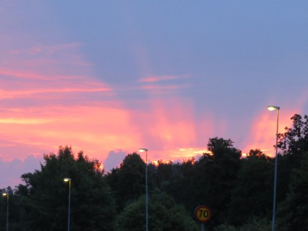
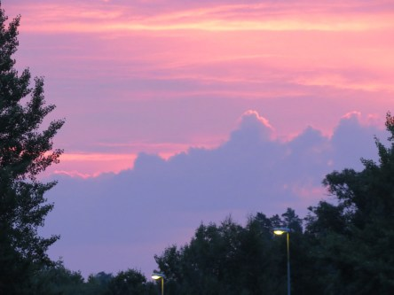

Idag går solen upp 04:40 och ned 21:33. Dagens längd är 16 timmar och 53 minuter. Det är gryning 03:45 och skymning 22:27 Det är dagsljus 18 timmar och 42 minuter. Månen går upp 13:07 och ned 00:01 Månen är belyst 42 %.

Molnigt 17,4 C  Vindby 1,4 m/s W  Luftfuktighet 91 %  hPa 1009 Kl.02:05

 Molnigt 18,2 C  Vindby 1,6 m/s W  Luftfuktighet 87 %  hPa 1010  Regn 0,7 mm Kl.06:30

 Växlande molnighet 33,2 C  Vindby 3,8 m/s W  Luftfuktighet 28 %  hPa 1008 Kl.14:30

 Växlande molnighet 19,9 C  Vindby 0,4 m/s WSW  Luftfuktighet 88 %  hPa 1008  Regn 1,7 mm Kl.19:50

 Nu är värmen tillbaka med full kraft. Usch!!!

Högst och lägst uppmätta temperatur igår (inofficiellt privat mätare): Max 35 C , Min 17,1 C Högst uppmätta vind 2,7  m/s. Högst uppmätta vindby 4,4  m/s

Högst och lägst uppmätta temperatur igår (officiellt enligt [YR.NO](http://www.vackertvader.se/v%C3%A4derstation/karlshamn?utm_source=email&utm_medium=email&utm_campaign=asarum)) Max 22 C, Min 18,4 C Högst uppmätta vind 3,5 m/s. Högst uppmätta vindby 7,4 m/s

 Det var en fantastisk vacker pastellfärgad soluppgång idag. Jag tros aldrig att jag har sett något liknade någonsin förut.
