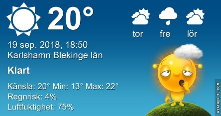

Idag går solen upp 06:39 och ned 19:08. Dagens längd är 12 timmar och 29 minuter. Det är gryning 06:02 och skymning 19:46 Det är dagsljus 13 timmar och 44 minuter. Månen går upp 17:32 och ned 01:04 Månen är belyst 70 %.

 Mest klart 9,2 C  Vindstilla  Luftfuktighet 98 %  hPa 1007 Kl.02:15

 Mest molnigt 10,3 C  Vindby 0,3 m/s E  Luftfuktighet 98 %  hPa 1008 Kl.06:25

 Tunna slöjmoln 24,7 C  Vindby 4,6 m/s NE  Luftfuktighet 61 %  hPa 1011 Kl.13:25

 Mest klart 14,7 C  Vindby 1,4 m/s E  Luftfuktighet 80 %  hPa 1010 Kl.19:50

 Ännu en torr och varm dag läggs till alla andra torra och dagar.

Högst och lägst uppmätta temperatur igår (inofficiellt privat mätare): Max 28,7 C ( i solen ), Min 7,9 C Högst uppmätta vind 2 m/s. Högst uppmätta vindby 3,7 m/s

Högst och lägst uppmätta temperatur igår (officiellt enligt [YR.NO](http://www.vackertvader.se/v%C3%A4derstation/karlshamn?utm_source=email&utm_medium=email&utm_campaign=asarum)) Max 21,4 C, Min 7,8 C Högst uppmätta vind 2,9 m/s. Högst uppmätta vindby 7,2 m/s

 

 Roligt och tänkvärt och en del att skratta åt.
