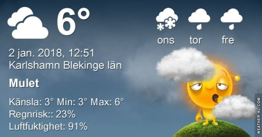
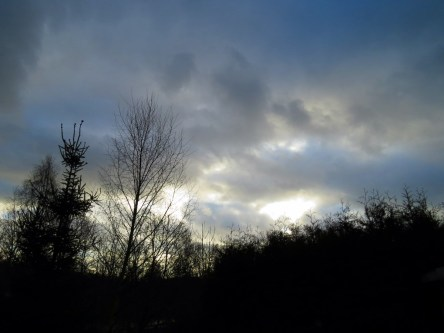

Idag går solen upp 08:33 och ned 15:36. Månen går upp 16:28 och ned 08:26 Månen är belyst 100 %. Dagens längd är 7 timmar och 3 minuter

 Molnigt 4 C  Vindby 4,8 m/s S  Luftfuktighet 88 %  hPa 991 Kl.02:25

 Växlande molnighet 4,1 C  Vindby 2 m/s S  Luftfuktighet 88 %  hPa 993 Kl.07:00

 Mest molnigt 7 C  Vindby 2 m/s NE  Luftfuktighet 84 %  hPa 997 Kl.12:50

 Växlande molnighet 3,5 C  Vindby 1,8 m/s S  Luftfuktighet 96 %  hPa 998 Kl.21:15

Högst och lägst uppmätta temperatur igår (inofficiellt privat mätare): Max 9,4 C , Min 3,2 C Högst uppmätta vind 4,8 m/s. Högst uppmätta vindby 7,6 m/s.

Högst och lägst uppmätta temperatur igår (officiellt enligt [YR.NO](http://www.vackertvader.se/v%C3%A4derstation/karlshamn?utm_source=email&utm_medium=email&utm_campaign=asarum)) Max 6, C, Min 2,3 C Högst uppmätta vind 2,6 m/s. Högst uppmätta vindby 10,9 m/s

 Gråväder.
