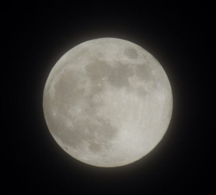
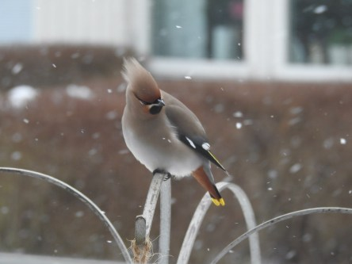
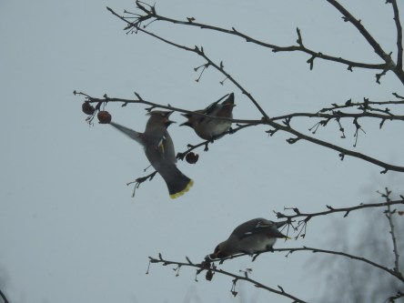

Idag går solen upp 06:51 och ned 17:35. Månen går upp 18:14 och ned 07:18 Månen är belyst 100 %. Dagens längd är 10 timmar och 44 minuter

 Växlande molnighet - 6,3 C  Vindby 2,2 m/s SSW  Luftfuktighet 76 %  hPa 1014 Kl.01:20

 Molnigt - 3,7 C  Vindby 1,7 m/s S  Luftfuktighet 77 %  hPa 1009 Kl.07:15

 Snö 0,6 C  Vindby 5,8 m/s W  Luftfuktighet 75 %  hPa 1007  Snödjup ca 11 cm Kl.13:30

 Molnigt - 5,7 C  Vindby 1,6 m/s NW  Luftfuktighet 75 %  hPa 1007 Kl.19:50

 Nu är jag verkligen less på vinterväder. Det borde väl bli vår nu istället för snöstorm.

Högst och lägst uppmätta temperatur igår (inofficiellt privat mätare): Max 0,7 C, Min – 9,1 C Högst uppmätta vind 4,4 m/s. Högst uppmätta vindby 7,1 m/s.

Högst och lägst uppmätta temperatur igår (officiellt enligt [YR.NO](http://www.vackertvader.se/v%C3%A4derstation/karlshamn?utm_source=email&utm_medium=email&utm_campaign=asarum)) Max – 4 C, Min – 8,7 C Högst uppmätta vind 3,5 m/s. Högst uppmätta vindby 9,4 m/s

 Nattens fullmåne var väldigt ljusstark och inte helt lätt att få en bra bild på. Den här blev halvbra.

 En frusen stenknäck tar en paus i matjakten.

 Snön yr kring sidensvansen.

 Starkast överlever. Här gäller det att se till att ingen stjäl maten mitt framför näbben på dig.

 Trädet är i stort sett tomt nu så då gäller det att leta upp små rester som finns kvar.
