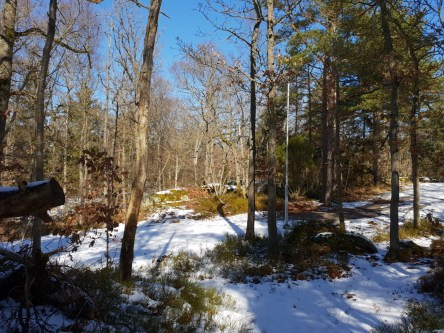
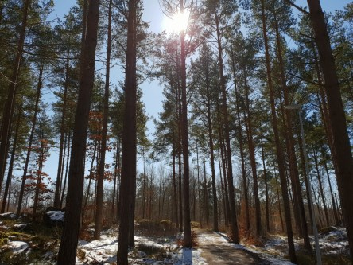
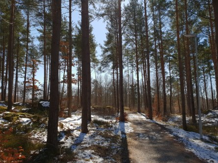
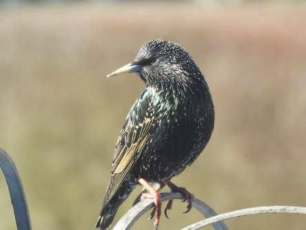

Idag går solen upp 06:29 och ned 19:40. Månen går upp 22:03 och ned 07:41 Månen är belyst 97 %. Dagens längd är 13 timmar och 11 minuter

 Halvklart - 1,5 C  Vindby 1 m/s W  Luftfuktighet 87 %  hPa 998 Kl.01:20

 Mest molnigt - 4 C  Vindstilla  Luftfuktighet 81 %  hPa 999 Kl.07:00

 Klart 12,7 C ( i solen )  Vindby 4,6 m/s W  Luftfuktighet 26 %  hPa 1000 Kl.13:35

 Halvklart 1 C  Vindby 1 m/s N  Luftfuktighet 32 %  hPa 1001 Kl.19:50

 Äntligen lite vår, med sol och riktigt varmt.

Högst och lägst uppmätta temperatur igår (inofficiellt privat mätare): Max 2,1 C  , Min – 1,2 C Högst uppmätta vind 3,7 m/s. Högst uppmätta vindby 10,4 m/s.

Högst och lägst uppmätta temperatur igår (officiellt enligt [YR.NO](http://www.vackertvader.se/v%C3%A4derstation/karlshamn?utm_source=email&utm_medium=email&utm_campaign=asarum)) Max 1,4 C, Min – 0,7 C Högst uppmätta vind 5,3 m/s. Högst uppmätta vindby 12,1 m/s

 Idag kunde man äntligen gå en runda i skogen igen. Solen sken och hela skogen fylldes av fågelsång. Vilken härlig känsla.

 Idag kom verkligen staren till sin rätt i sin blänkande vackra fjäderdräkt. Den blev som en gnistrande ädelsten i solskenet.
