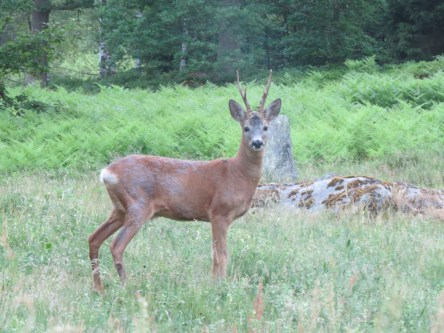
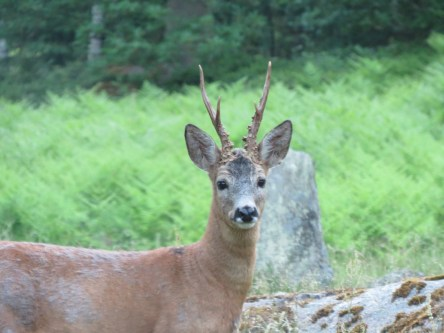
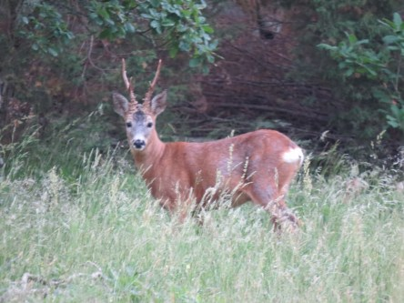

Idag går solen upp 04:20 och ned 21:37. Månen går upp 00:33 och ned 07:36 Månen är belyst 89 %. Dagens längd är 17 timmar och 17 minuter

 Klart 8,9 C  Vindstilla  Luftfuktighet 95 %  hPa 1011 Kl.02:00

 Klart 13,3 C  Vindstilla  Luftfuktighet 73 %  hPa 1011 Kl.06:30

 Klart 32,4 C  Vindby 3,4 m/s NW  Luftfuktighet 26 %  hPa 1011 Kl.14:45

 Klart 20,4 C  Vindby 1,4 m/s ENE  Luftfuktighet 57 %  hPa 1010 Kl.19:55

 Värmen ger sig inte. Storkungar riskerar att dö av svält. Fågelungar kastar sig ur boet i panik för att det är för varmt under taken där de har sitt bo. Skördar riskerar att utebli och vattnet kan sina på vissa ställen. Sommar och värme är härligt i måttliga mängder. Men nu har det gått för långt. Snart blir det katastrof om det inte kommer regn.

Högst och lägst uppmätta temperatur igår (inofficiellt privat mätare): Max 34,1 C ( i solen ), Min 8,8 C Högst uppmätta vind 2 m/s. Högst uppmätta vindby 4,8 m/s

Högst och lägst uppmätta temperatur igår (officiellt enligt [YR.NO](http://www.vackertvader.se/v%C3%A4derstation/karlshamn?utm_source=email&utm_medium=email&utm_campaign=asarum)) Max 25.3 C, Min 7,4 C Högst uppmätta vind 4,6 m/s. Högst uppmätta vindby 8,5 m/s

 Eftersom jag är väldigt trött på soluppgångar nu så blev jag glad över att stöta på det här rådjuret så att jag fick ett betydligt roligare motiv att fotografera.
