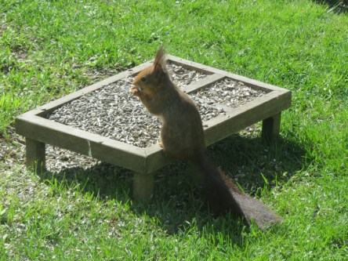

Idag går solen upp 06:06 och ned 19:53. Dagens längd är 13 timmar och 47 minuter. Det är gryning 05:26 och skymning 20:33 Det är dagsljus 15 timmar och 07 minuter. Månen går upp 22:57 och ned 13:53 Månen är belyst 62 %.

 Växlande molnighet  9,8 C  Vindby 0,3 m/s NW  Luftfuktighet 97 %  hPa 1023 Kl.01:50

 Växlande molnighet 12,7 C  Vindstilla  Luftfuktighet 97 %  hPa 1025 Kl.07:00

 Mest molnigt 23,2 C  Vindby 1,8 m/s SE  Luftfuktighet 66 %  hPa 1025 Kl.13:30

 Halvklart 15,5 C  Vindby 1,2 m/s E  Luftfuktighet 79 %  hPa 1024 Kl.19:45

 Värmen håller sig kvar och regnet håller sig borta!

Högst och lägst uppmätta temperatur igår (inofficiellt privat mätare): Max 21,7 C , Min 10,3 C Högst uppmätta vind 1,7 m/s. Högst uppmätta vindby 3,1 m/s

Högst och lägst uppmätta temperatur igår (officiellt enligt [YR.NO](http://www.vackertvader.se/v%C3%A4derstation/karlshamn?utm_source=email&utm_medium=email&utm_campaign=asarum)) Max 18,4 C, Min 10,5 C Högst uppmätta vind 3 m/s. Högst uppmätta vindby 6,2 m/s

 Arkivbilder på "mina" söta ekorrar som jag saknar så mycket. de besökte mig flera gånger om dagen ett par somrar men sen har jag inte sett till dem mer.

 Och några arkivbilder på tulpaner i regnskrud.
