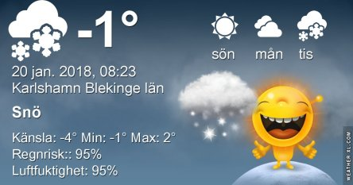
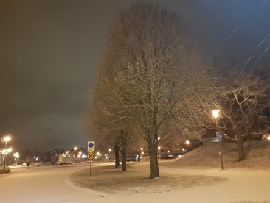

Idag går solen upp 08:17 och ned 16:06. Månen går upp 09:45 och ned 19:57 Månen är belyst 8 %. Dagens längd är 7 timmar och 49 minuter

 Växlande molnighet - 1,6 C  Vindby 1 m/s S  Luftfuktighet 95 %  hPa 1000 Kl.02:15

 Molnigt - 1 C  Vindby 1,8 m/s NW  Luftfuktighet 98 %  hPa 999  Snö ca. 2 cm Kl.07:15

 Molnigt 2,4 C  Vindstilla  Luftfuktighet 96 %  hPa 999 Kl.14:45

 Molnigt - 0,2 C  Vindstilla  Luftfuktighet 97 %  hPa 1000 Kl.19:50

 Äntligen lördag och en natt ledigt. Och lite vitt ute som lyser upp

Högst och lägst uppmätta temperatur igår (inofficiellt privat mätare): Max 8,6 ( i solen ) C , Min – 4,9 C Högst uppmätta vind 0,7 m/s. Högst uppmätta vindby 1,7 m/s.

Högst och lägst uppmätta temperatur igår (officiellt enligt [YR.NO](http://www.vackertvader.se/v%C3%A4derstation/karlshamn?utm_source=email&utm_medium=email&utm_campaign=asarum)) Max 1,2 C, Min – 3,8 C Högst uppmätta vind 2,2 m/s. Högst uppmätta vindby 3,5 m/s

 Vintern kommer och går med jämna mellanrum.
