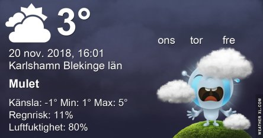

Idag går solen upp 07:48 och ned 15:44 Dagens längd är 7 timmar och 56 minuter. Det är gryning 07:04 och skymning 16:27 Det är dagsljus 9 timmar och 23 minuter. Månen går upp 15:16 och ned 03:27 Månen är belyst 89 %.

 Klart - 0,3 C  Vindby 3 m/s E  Luftfuktighet 85 %  hPa 1027 Kl.02:25

 Växlande molnighet 1,2 C  Vindby 2 m/s N  Luftfuktighet 86 %  hPa 1025 Kl.07:45

 Mest molnigt 4,6 C  Vindby 3,6 m/s E  Luftfuktighet 82 %  hPa 1023  Regn 0,5 mm Kl.15:05

 Växlande molnighet och något regnstänk 1,6 C  Vindby 2,6 m/s N  Luftfuktighet 82 %  hPa 1023 Kl.21:30

 Usch vad det är mörkt och kallt och ruggigt!

Högst och lägst uppmätta temperatur igår (inofficiellt privat mätare): Max 7,7 C , Min 0,1 C Högst uppmätta vind 2,7 m/s, Högst uppmätta vindby 5,4 m/s

Högst och lägst uppmätta temperatur igår (officiellt enligt [YR.NO](http://www.vackertvader.se/v%C3%A4derstation/karlshamn?utm_source=email&utm_medium=email&utm_campaign=asarum)) Max 5,7 C, Min 1,3 C Högst uppmätta vind 3,5 m/s. Högst uppmätta vindby 8,8 m/s

\[gallery type="square" size="medium" link="file" ids="25536,25537,25538,25539,25540,25542,25543"\]

Trött, seg och omotiverad. Det är jag just nu. Så några kloka ord är vad som behövs. Här är de.
