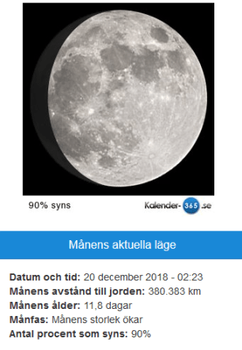

Idag går solen upp 08:31 och ned 15:25 Dagens längd är 6 timmar och 54 minuter. Det är gryning 07:43 och skymning 16:13 Det är dagsljus 8 timmar och 30 minuter. Månen går upp 14:22 och ned 04:57 Månen är belyst 90 %.

Lätt regn 1,5 C  Vindby 1,8 m/s NE  Luftfuktighet 88 %  hPa 1013  Regn 1,5 mm Kl.02:20

 Duggregn 2 C  Vindby 2 m/s E  Luftfuktighet 88 %  hPa 1012  Regn 2,3 mm Kl.06:40

 Molnigt 2,7 C  Vindby 2,8 m/s E  Luftfuktighet 87 %  hPa 1011 Kl.13:40

 Molnigt 1,4 C  Vindby 2,2 m/s E  Luftfuktighet 87 %  hPa 1011  Regn 3 mm Kl.19:55

 Vintern är över och allt är grått igen!

Högst och lägst uppmätta temperatur igår (inofficiellt privat mätare) Max 5 C , Min 2,1 C Högst uppmätta vind 3,1 m/s, Högst uppmätta vindby 5,8 m/s

Högst och lägst uppmätta temperatur igår (officiellt enligt [YR.NO](http://www.vackertvader.se/v%C3%A4derstation/karlshamn?utm_source=email&utm_medium=email&utm_campaign=asarum)) Max ? C, Min ? C Högst uppmätta vind ? m/s. Högst uppmätta vindby ? m/s

\[gallery type="rectangular" link="file" size="medium" ids="26126,26125,26124,26119,26120,26123"\]

Fåglar i snöväder.

\[gallery type="circle" link="file" size="medium" ids="26129,26128,26127,26121,26122" orderby="rand"\]

Så här såg det ut härom dagen. Nu är allt borta!
