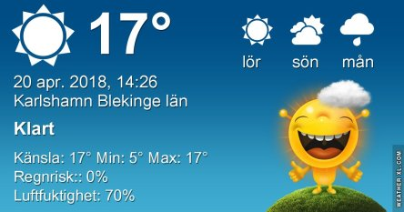
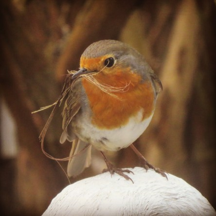
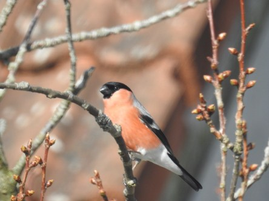
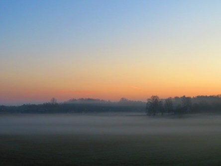
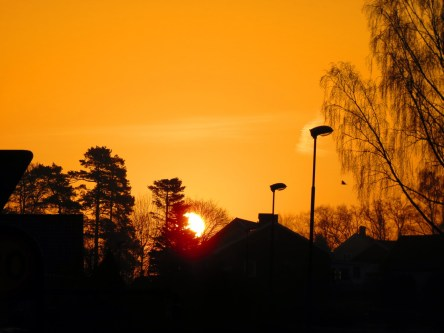
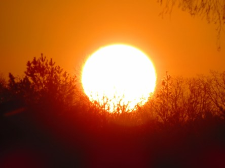

Idag går solen upp 05:43 och ned 20:17. Månen går upp 08:39 och ned 01:42 Månen är belyst 20 %. Dagens längd är 14 timmar och 34 minuter

 Klart 3,9 C  Vindstilla  Luftfuktighet 98 %  hPa 1023 Kl.02:25

 Tunna slöjmoln 4,6 C  Vindstilla  Luftfuktighet 98 %  hPa 1021 Kl.06:55

 Klart 21,7 C  Vindby 2 m/s W  Luftfuktighet 58 %  hPa 1017 Kl.13:40

 Mest klart 12,2 C  Vindstilla  Luftfuktighet 76 %  hPa 1009 Kl.20:00

 Ännu en härligt varm sommardag.

Högst och lägst uppmätta temperatur igår (inofficiellt privat mätare): Max 25 C , Min 5,7 C Högst uppmätta vind 2,4 m/s. Högst uppmätta vindby 4 m/s.

Högst och lägst uppmätta temperatur igår (officiellt enligt [YR.NO](http://www.vackertvader.se/v%C3%A4derstation/karlshamn?utm_source=email&utm_medium=email&utm_campaign=asarum)) Max 21,8 C, Min 4,5 C Högst uppmätta vind 3,7 m/s. Högst uppmätta vindby 8,1 m/s

 Min nya hyresgäst är i full gång med att möblera. Sista bildenär tagen mellan persiennerna för att inte skrämma den.

 Här har jag redigerat bilden så att detaljerna kommer fram.

 Och en väldigt oväntad gäst dök upp på morgonen. Det tillhör inte vanligheterna att Domherren finns här så här långt in på våren.

 Och min dagliga trogna gäst kom även idag.

 Några bilder från dagens soluppgång som började med dimma som låg som en vacker slöja på marken.
