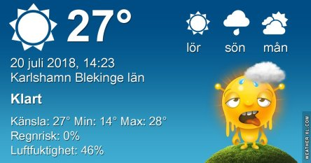
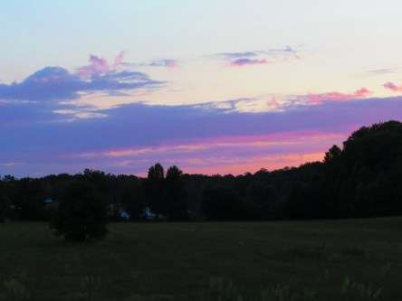
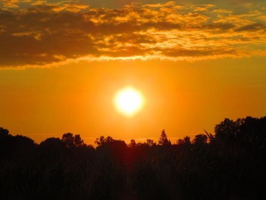

Idag går solen upp 04:42 och ned 21:31. Dagens längd är 16 timmar och 49 minuter. Det är gryning 03:47 och skymning 22:25 Det är dagsljus 18 timmar och 38 minuter. Månen går upp 14:23 och ned 00:19 Månen är belyst 53 %.

 Mest klart 14,9 C  Vindby 1,4 m/s S  Luftfuktighet 68 %  hPa 1009 Kl.02:05

 Mest klart 19,1 C  Vindby 2,2 m/s ENE  Luftfuktighet 65 %  hPa 1008 Kl.06:55

 Klart 34,6 C  Vindby 3,8 m/s SSW  Luftfuktighet 35 %  hPa 1007 Kl.14:00

 Mest klart 25,2 C  Vindby 1,7 m/s NE  Luftfuktighet 43 %  hPa 1006 Kl.19:55

 Jag hittar inga ord längre för hur less jag är på denna plågsamma värme. Snart bokar jag en resa till Svalbard! 😂

Högst och lägst uppmätta temperatur igår (inofficiellt privat mätare): Max 35 C , Min 16,5 C Högst uppmätta vind 2,7  m/s. Högst uppmätta vindby 4,4  m/s

Högst och lägst uppmätta temperatur igår (officiellt enligt [YR.NO](http://www.vackertvader.se/v%C3%A4derstation/karlshamn?utm_source=email&utm_medium=email&utm_campaign=asarum)) Max 29,5 C, Min 16,4 C Högst uppmätta vind 3,8 m/s. Högst uppmätta vindby 8,8 m/s

 Även idag började soluppgången i pastellfärger.

 För att sen gå över i gassande glödhet orange.

 Ett rådjur försöker hitta lite att äta i det torra gräset.
