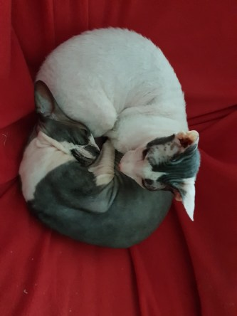
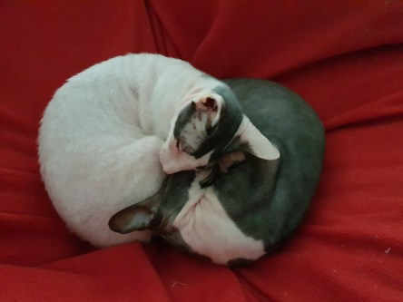
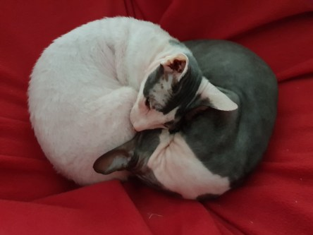
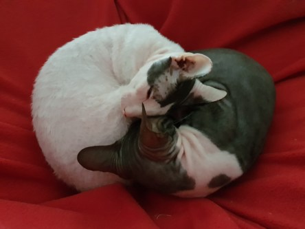

Idag går solen upp 05:40 och ned 20:26. Dagens längd är 14 timmar och 46 minuter. Det är gryning 04:58 och skymning 21:08 Det är dagsljus 16 timmar och 10 minuter. Månen går upp 16:48 och ned 00:39 Månen är belyst 67 %.

 Molnigt 17,1 C  Vindby 3,7 m/s SE  Luftfuktighet 82 %  hPa 1008 Kl.02:20

 Molnigt 16,5 C  Vindby 1,6 m/s SW  Luftfuktighet 94 %  hPa 1006 Kl.06:50

 Växlande molnighet 26,6 C  Vindby 3,4 m/s W  Luftfuktighet 54 %  hPa 1006 Kl.13:40

 Mest molnigt 17,5 C  Vindby 2,4 m/s ENE  Luftfuktighet 63 %  hPa 1008 Kl.19:50

 Det kom en liten regnskvätt idag. Men inte ens mätbar.

Högst och lägst uppmätta temperatur igår (inofficiellt privat mätare): Max 26,4 C, Min 17,3 C Högst uppmätta vind 3,4 m/s. Högst uppmätta vindby 5,8 m/s

Högst och lägst uppmätta temperatur igår (officiellt enligt [YR.NO](http://www.vackertvader.se/v%C3%A4derstation/karlshamn?utm_source=email&utm_medium=email&utm_campaign=asarum)) Max 22 C, Min 17,8 C Högst uppmätta vind 2,3 m/s. Högst uppmätta vindby 7,2 m/s

 Far och dottermys. Min äldsta sons goa katter gosar i fåtöljen.
