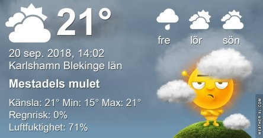
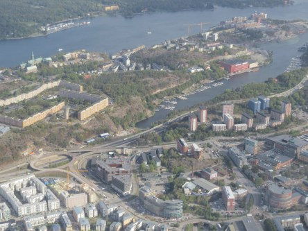
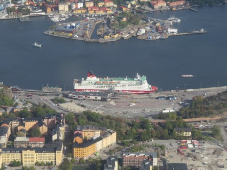
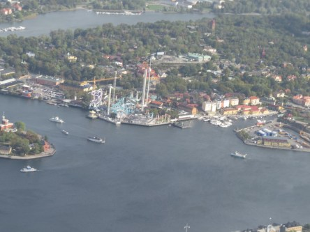
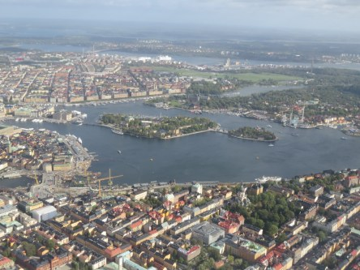
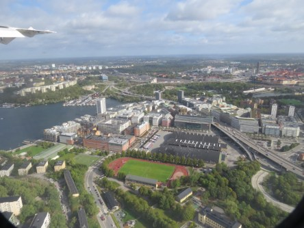

Idag går solen upp 06:41 och ned 19:05. Dagens längd är 12 timmar och 24 minuter. Det är gryning 06:04 och skymning 19:43 Det är dagsljus 13 timmar och 39 minuter. Månen går upp 17:49 och ned 00:56 Månen är belyst 70 %.

 Mest klart 12,8 C  Vindstilla  Luftfuktighet 92 %  hPa 1009 Kl.02:10

 Molnigt 14 C  Vindby 1,6 m/s NNW  Luftfuktighet 87 %  hPa 1008 Kl.06:25

 Mest molnigt 24,5 C  Vindby 3,4 m/s SE  Luftfuktighet 63 %  hPa 1008 Kl.13:40

 Molnigt 16,4 C  Vindby 0,3 m/s E  Luftfuktighet 80 %  hPa 1008 Kl.19:55

 Mycket svarta moln men inget regn ännu.

Högst och lägst uppmätta temperatur igår (inofficiellt privat mätare): Max 26,3 C ( i solen ), Min 7,9 C Högst uppmätta vind 3,1 m/s. Högst uppmätta vindby 5,1 m/s

Högst och lägst uppmätta temperatur igår (officiellt enligt [YR.NO](http://www.vackertvader.se/v%C3%A4derstation/karlshamn?utm_source=email&utm_medium=email&utm_campaign=asarum)) Max 20,4 C, Min 7,9 C Högst uppmätta vind 3,1 m/s. Högst uppmätta vindby 6,9 m/s

 En salig Stockholmsblandning del 5. Lite flygbilder över Stockholm när vi kom in för landning.
