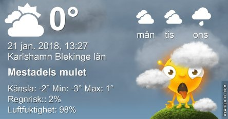
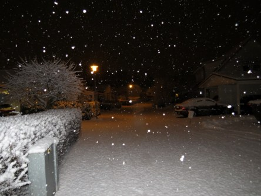

Idag går solen upp 08:15 och ned 16:08. Månen går upp 10:05 och ned 21:09 Månen är belyst 14 %. Dagens längd är 7 timmar och 53 minuter

 Snö - 0,5 Vindstilla  Luftfuktighet 98 %  hPa 1002 Kl.01:05

 Molnigt - 0,5 C  Vindstilla  Luftfuktighet 98 %  hPa 999  Snö 6 cm Kl.07:30

 Molnigt 4,5 C  Vindstilla  Luftfuktighet 95 %  hPa 1010 Kl.13:25

 Molnigt - 1,6 C  Vindstilla  Luftfuktighet 96 %  hPa 1012 Kl.20:00

 Inatt blev det riktig vinter här med massor av snö.

Högst och lägst uppmätta temperatur igår (inofficiellt privat mätare): Max 2,4 C , Min – 4,9 C Högst uppmätta vind 1 m/s. Högst uppmätta vindby 2 m/s.

Högst och lägst uppmätta temperatur igår (officiellt enligt [YR.NO](http://www.vackertvader.se/v%C3%A4derstation/karlshamn?utm_source=email&utm_medium=email&utm_campaign=asarum)) Max 0,9 C, Min – 1,8 C Högst uppmätta vind 1,2 m/s. Högst uppmätta vindby 3,2 m/s

 Bilder från nattens snöväder tagna med Canon.

 Bilder från nattens snöväder tagna med Nikon.
