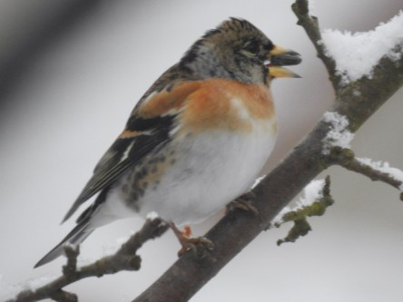
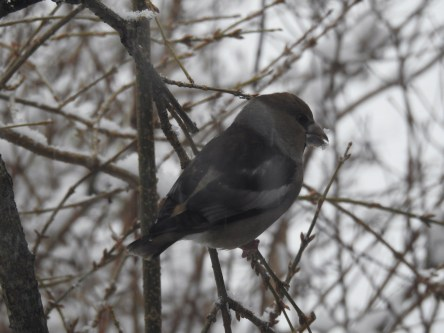
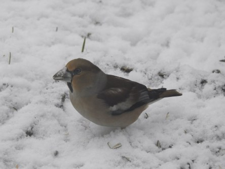
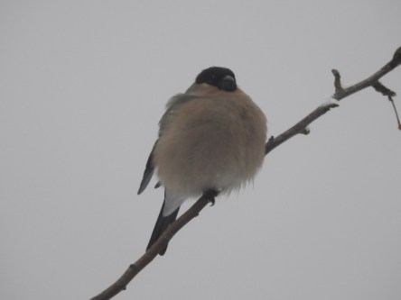
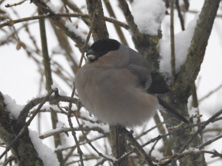
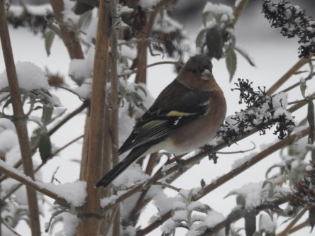

Idag går solen upp 07:13 och ned 17:16. Månen går upp 09:28 och ned 00:02 Månen är belyst 26 %. Dagens längd är 10 timmar och 3 minuter

 Molnigt - 1,9 C  Vindby 1,2 m/s SW  Luftfuktighet 85 %  hPa 1022 Kl.02:25

 Snö - 2,4 C  Vindstilla  Luftfuktighet 87 %  hPa 1022 Kl.06:45

 Snö 3,3 C  Vindby 0,7 m/s W  Luftfuktighet 80 %  hPa 1021  Snö/regn 1,2 mm Kl.14:15

 Växlande molnighet - 2,3 C  Vindstilla  Luftfuktighet 92 %  hPa 1022  Snö ca 5 cm Kl.20:25

 Nu är jag verkligen less på vinter och kallt.

Högst och lägst uppmätta temperatur igår (inofficiellt privat mätare): Max 2,3 C, Min – 5,7 C Högst uppmätta vind 2 m/s. Högst uppmätta vindby 4,1 m/s.

Högst och lägst uppmätta temperatur igår (officiellt enligt [YR.NO](http://www.vackertvader.se/v%C3%A4derstation/karlshamn?utm_source=email&utm_medium=email&utm_campaign=asarum)) Max 0,9 C, Min – 4,1 C Högst uppmätta vind 2,1 m/s. Högst uppmätta vindby 5,4 m/s

 Det blev full fart bland fåglarna i vintervädret idag. Här en berfink.

 Här några stenknäckar.

 En duva kom vandrande i snön.

 Mamma Hacke var också hungrig.

 Här har fru Domherre fluffat upp sig.

 Sidensvansarna kom tillbaka också.

 Den lilla järnsparven kommer troget varje dag.

 En bergfink gömmer sig i busken.

 Till slut en ny gäst i trädgården. Den här lilla gärdsmygen dö helt plötsligt upp, men på grund av det ymniga snöandet så hann jag inte få någon bra bild eftersom kameran inte hann fokusera innan den flög lika fort som den kom.
