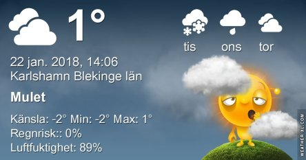
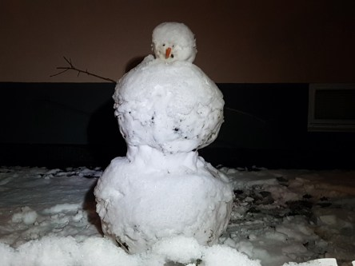
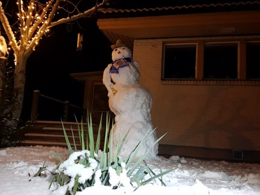

Idag går solen upp 08:14 och ned 16:10. Månen går upp 10:24 och ned 22:22 Månen är belyst 22 %. Dagens längd är 7 timmar och 56 minuter

 Molnigt - 1,3 C  Vindstilla  Luftfuktighet 97 %  hPa 1011 Kl.01:25

 Molnigt - 1,6 C   Vindstilla  Luftfuktighet 99 %  hPa 1009 Kl.06:50

 Molnigt 2,4 C  Vindby 1 m/s SSW  Luftfuktighet 84 %  hPa 1008 Kl.13:45

 Molnigt - 0,6 C  Vindby 1,6 m/s W  Luftfuktighet 83 %  hPa 1011 Kl.20:15

 Fifty shades of grey fortfarande.

Högst och lägst uppmätta temperatur igår (inofficiellt privat mätare): Max 4,6 C , Min – 1,9 C Högst uppmätta vind 0 m/s. Högst uppmätta vindby 0,3 m/s.

Högst och lägst uppmätta temperatur igår (officiellt enligt [YR.NO](http://www.vackertvader.se/v%C3%A4derstation/karlshamn?utm_source=email&utm_medium=email&utm_campaign=asarum)) Max 1,6 C, Min – 3,8 C Högst uppmätta vind 1,4 m/s. Högst uppmätta vindby 2,6 m/s

 Inatt var det snögubbarnas natt.
