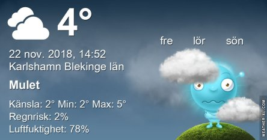

Idag går solen upp 07:52 och ned 15:41 Dagens längd är 7 timmar och 49 minuter. Det är gryning 07:08 och skymning 16:25 Det är dagsljus 9 timmar och 17 minuter. Månen går upp 15:57 och ned 06:06 Månen är belyst 98 %.

 Molnigt 2,5 C  Vindby 1,4 m/s E  Luftfuktighet 77 %  hPa 1025 Kl.02:10

 Molnigt 2,2 C  Vindby 1,7 m/s NNE  Luftfuktighet 80 %  hPa 1025 Kl.07:20

 Molnigt 4,2 C  Vindby 0,6 m/s E  Luftfuktighet 78 %  hPa 1023 Kl.14:45

 Molnigt 1,7 C  Vindby 1,2 m/s E  Luftfuktighet 81 %  hPa 1023 Kl.19:50

 kallt och grått. Men ingen snö!!! Jippi!

Högst och lägst uppmätta temperatur igår (inofficiellt privat mätare): Max 4,7 C , Min  0,1 C Högst uppmätta vind 3,7 m/s, Högst uppmätta vindby 5,8 m/s

Högst och lägst uppmätta temperatur igår (officiellt enligt [YR.NO](http://www.vackertvader.se/v%C3%A4derstation/karlshamn?utm_source=email&utm_medium=email&utm_campaign=asarum)) Max 4 C, Min 1,6 C Högst uppmätta vind 3,1 m/s. Högst uppmätta vindby 7,3 m/s

 Gissa vad jag tycker om köphysterin som kallas Black Friday?

\[gallery type="rectangular" size="medium" link="file" ids="25574,25575,25576,25577,25578,25579"\]
