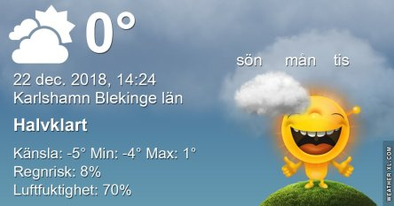

Idag går solen upp 08:32 och ned 15:26 Dagens längd är 6 timmar och 54 minuter. Det är gryning 07:44 och skymning 16:14 Det är dagsljus 8 timmar och 30 minuter. Månen går upp 15:38 och ned 07:38 Månen är belyst 99 %.

Molnigt 0,1 C  Vindby 4,8 m/s ENE  Luftfuktighet 87 %  hPa 996 KL.02:25

 Molnigt och en del snö - 0,7 C  Vindby 4,8 m/s N  Luftfuktighet 84 %  hPa 998 Kl.07:00

 Molnigt 1,6 C  Vindby 2 m/s W  Luftfuktighet 77 %  hPa 1004 Kl.14:05

Växlande molnighet - 4,8 C  Vindstilla  Luftfuktighet 81 %  hPa 1008 Kl.20:00

 Idag kom det lite snö igen. Men nu slipper jag ut och jobba i det! Det stavas SEMESTER!

Högst och lägst uppmätta temperatur igår (inofficiellt privat mätare) Max 2,9 C , Min 1,2 C Högst uppmätta vind 3,7 m/s, Högst uppmätta vindby 6,1 m/s

Högst och lägst uppmätta temperatur igår (officiellt enligt [YR.NO](http://www.vackertvader.se/v%C3%A4derstation/karlshamn?utm_source=email&utm_medium=email&utm_campaign=asarum)) Max ? C, Min ? C Högst uppmätta vind ? m/s. Högst uppmätta vindby ? m/s

 Just nu kan jag inte låta bli att knåpa ihop sådana här citat till små tavlor. Jag hoppas ni står ut med dem ett tag till! ( Klicka på dem så blir det lättare att läsa texten )

