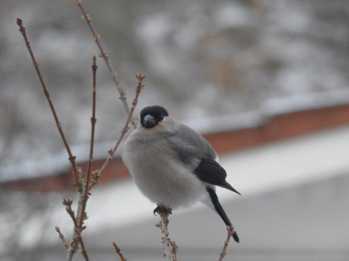
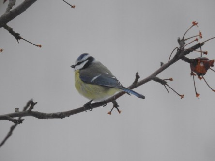
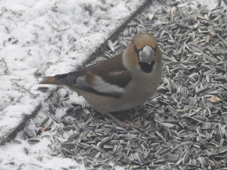
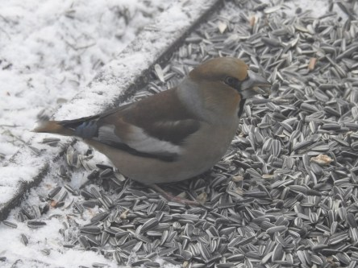
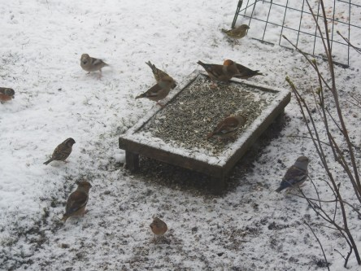

Idag går solen upp 07:11 och ned 17:18. Månen går upp 09:53 och ned 00:02 Månen är belyst 36 %. Dagens längd är 10 timmar och 7 minuter

 Växlande molnighet - 5,9 C  Vindstilla  Luftfuktighet 86 %  hPa 1023 Kl.01:55

 Mest molnigt - 5,5 C  Vindby 0,4 m/s N  Luftfuktighet 79 %  hPa 1024 Kl.07:20

 Snö 2,6 C  Vindby 1,8 m/s NW  Luftfuktighet 70 %  hPa 1025 Kl.13:55

 Växlande molnighet - 5,4 C  Vindstilla  Luftfuktighet 78 %  hPa 1025 Kl.19:50

 Adjöss med röda siffror på ett tag, nu gäller blåa både dag och natt.

Högst och lägst uppmätta temperatur igår (inofficiellt privat mätare): Max 4,1 C, Min – 3,9 C Högst uppmätta vind 1 m/s. Högst uppmätta vindby 2 m/s.

Högst och lägst uppmätta temperatur igår (officiellt enligt [YR.NO](http://www.vackertvader.se/v%C3%A4derstation/karlshamn?utm_source=email&utm_medium=email&utm_campaign=asarum)) Max 0,1 C, Min – 6,4 C Högst uppmätta vind 1,7 m/s. Högst uppmätta vindby 4,5 m/s

 Det var full hålligång vid frukostbuffén idag.

 Vissa var mer benägna än andra att ta för sig.
