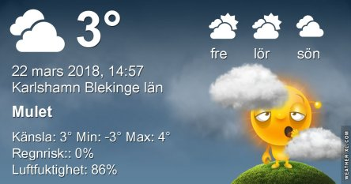
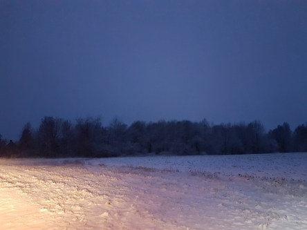
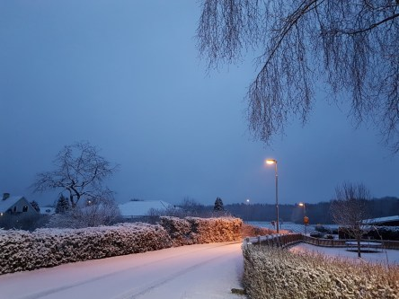

Idag går solen upp 05:58 och ned 18:17. Månen går upp 08:24 och ned 00:28 Månen är belyst 22 %. Dagens längd är 12 timmar och 19 minuter

 Molnigt - 0,5 C  Vindby 1,6 m/s WSW  Luftfuktighet 83 %  hPa 1006 Kl.02:15

 Snö - 0,4 C  Vindby 1,6 m/s WNW  Luftfuktighet 95 %  hPa 1002  Snö ca 2 cm Kl.06:35

 Molnigt 3,8 C  Vindstilla  Luftfuktighet 82 %  hPa 1002 Kl.13:50

 Molnigt 0,4 C  Vindstilla  Luftfuktighet 84 %  hPa 1003 Kl.19:55

 Snö hela natten och sen töväder men kallt.

Högst och lägst uppmätta temperatur igår (inofficiellt privat mätare): Max 10.6 C ( i solen ) , Min – 10,5 C Högst uppmätta vind 3,1 m/s. Högst uppmätta vindby 4,4 m/s.

Högst och lägst uppmätta temperatur igår (officiellt enligt [YR.NO](http://www.vackertvader.se/v%C3%A4derstation/karlshamn?utm_source=email&utm_medium=email&utm_campaign=asarum)) Max 4,5 C, Min – 8,6 C Högst uppmätta vind 3,1 m/s. Högst uppmätta vindby 7 m/s

 Inatt blev det full vinter... IGEN!
